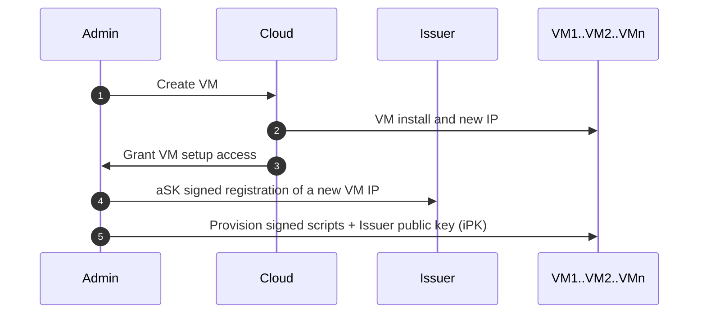
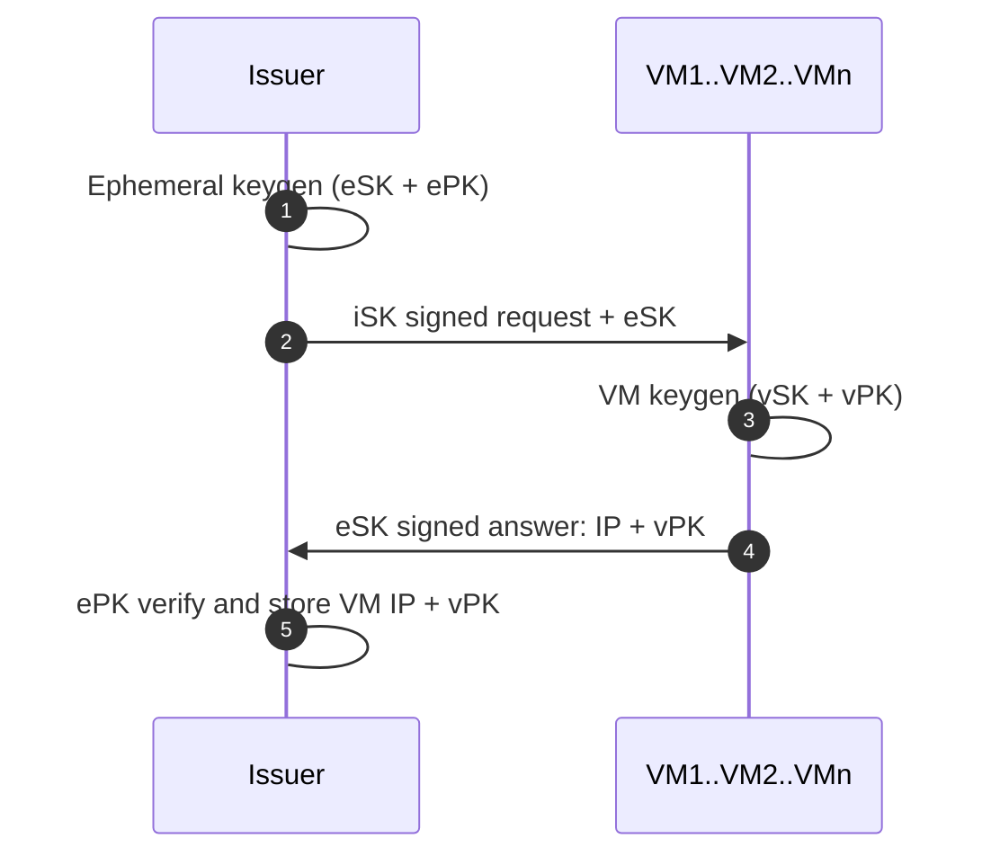
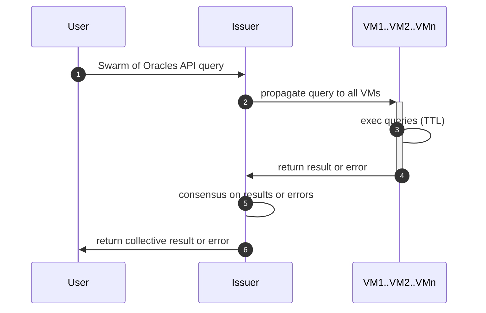
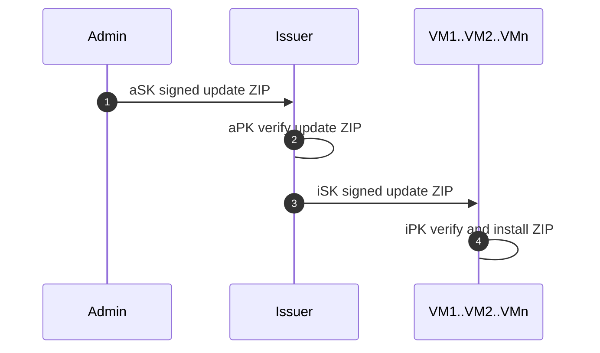
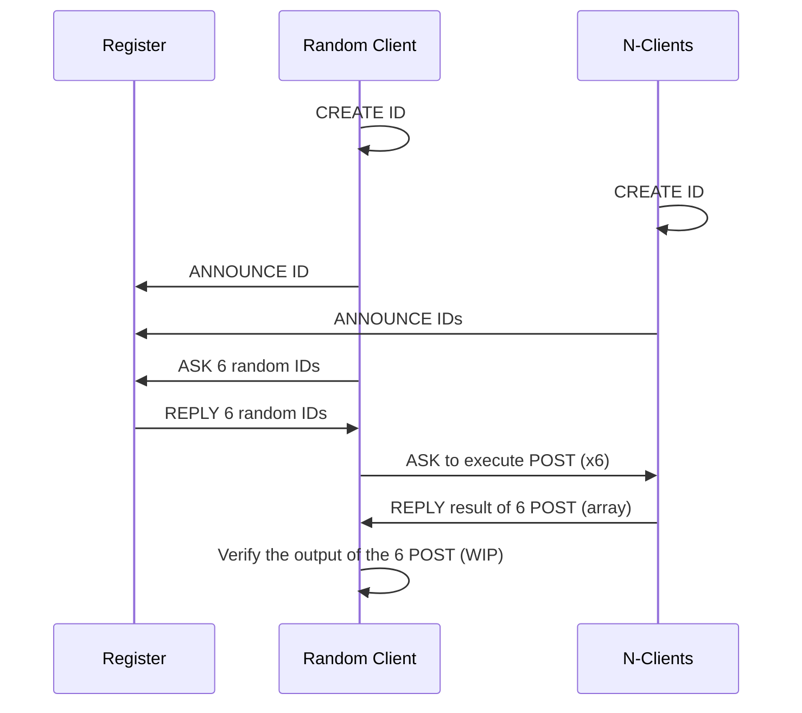
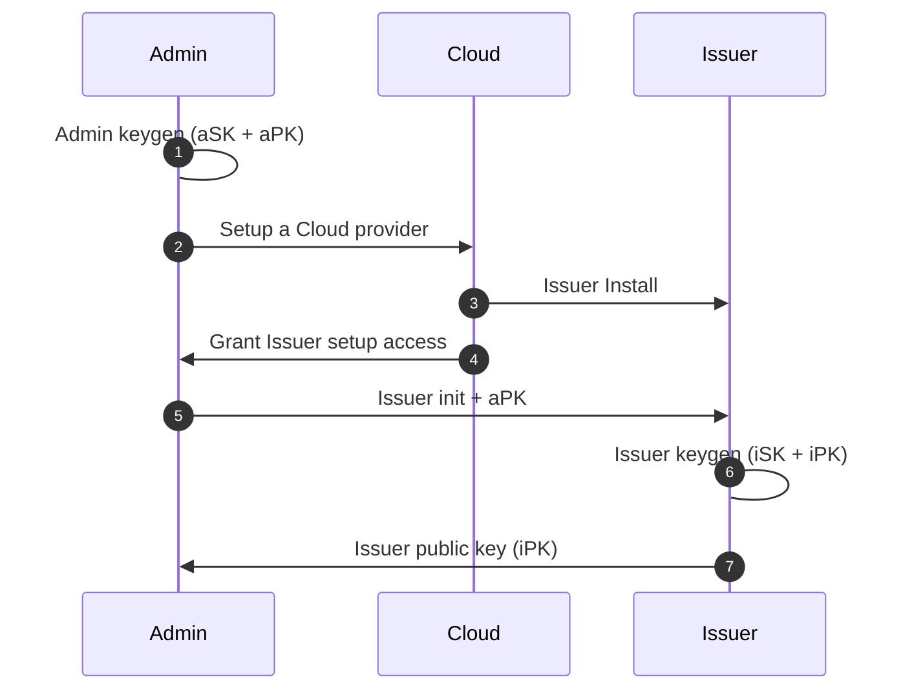

# Zenswarm
Protototype of Zenroom based Swarm of Oracles 

# Requirements
* a Debian based machine (the provisioning script uses apt)
* node 14
* (Server only) redis running on port 6379
* pm2
* the hostname on the host machine, must be reachable from the internet (can be an IP), the oracle use the hostname to announce their identities to the tracker
* ports between the 25000 and 30000 must be open on the host machine
* add the pubkey you will use todeploy from your workstation (when using root user, in /root/.ssh/authorized_keys )
* open a port for ansible, can be configured in hosts.toml (default: *ansible_port=22254*)
* the oracles' ansible installs an SSL certificate using Letsencrypt and the oracle currently comunicates via https. This can generate issues on machines behind a proxy (e.g. a virtual machine).  

# How to run

* *git clone https://github.com/dyne/zenswarm/*
* *cd ansible* 
* edit hosts.toml to set: 
  * address of target machine for deployment (default: zenswarm.zenroom.org ) 
  * set user to log in the target machine (default: root) 
  * port that ansible will use to connect to the host (default: *ansible_port=22254*)
  * amount of oracles to be deployed on that machine (default: *nodes=3*)
* edit run_ansible_example.sh, to configure the endpoints that the oracles will use to announce and unannounce (the W3C-DID controller)  
* run run_ansible_example.sh
* edit *subscription.csv* to define which Oracle will notarize from which L1 to which L0

# Monitoring

* On the machines where the oracles are deployed, use **pm2 list** to see how many instances of restroom_mw are running.
* A GUI-based monitoring service for the Oracle is the [SoO-Dashboard](https://github.com/dyne/SoO-Dashboard). The GUI retrieves a list of the active Oracles from the W3C-DID controller

# Provisioning

Once an Oracle is deployed, each Oracles tries to *announce* to the W3C-DID controller. In this stage, the Oracle will communicate its pubkeys, its version and some metadata. The W3C-DID Controller will register a DID per each Oracle, and store the DID-document on a database and blockchain. 

Upon graceful shutdown, done via *pm2 delete [instansce-name]*, the Oracle will *deannounce* itself, which will prompt the W3C-DID Controller to remove the Oracle from the database.

Specs about the DID implementation is in [Dyne.org's W3C-DID](https://github.com/dyne/W3C-DID).

# Oracles flows


## Oracle creation



1. Admin orders the creation of a VM to the Cloud provider
1. Cloud provider creates the VM on a new allocated IP and installs a signed OS
1. Cloud provider grants the Admin setup access to the VM (IP + SSH)
1. Admin signs a message to register the new VM IP on the Issuer
1. Admin provisions the VM with a signed OS setup and the Issuer public key

## Oracle key issuance

**Note: the current provisioning flow is meant for a permissionless network**, for testing purposes. In the current provisioning, the ephemeral key is delivered within the *announce* flow, in a single communication channel. In order to set up a permissioned network, the announce mechanism can be split and the **ephemeral key can be send on a side channel**. 



1. Issuer generates an ephemeral keypair used only to verify the VM registration
1. Issuer signs the ephemeral secret key with iSK and sends a request to the VM IP
1. VM verifies the registration request with iPK and generates a VM keypair (vSK + vPK)
1. VM signs an answer with eSK and sends back its public key
1. Issuer verifies the answer signed with ePK and saves the VM public key and its IP

At the end of the process the ephemeral keys are discarded and the Issue has added to its database a new IP and its associated public key.

## Swarm operation


1. A query is made to the Swarm of Oracles Issuer by a User (or an event or a time trigger)
1. Issuer parses and validates the query syntax, then propagates to all oracle VMs
1. VMs execute the Zencode associated to the query: may access other online services, query databases and external APIs
1. VMs return results of the Zencode execution or an error
1. Issuer verifies that all results are equal (full consensus) or raises an error
1. Issuer returns the verified result of the query or a list of specific errors occurred

## Oracle update


1. Admin signs and uploads a ZIP with updated scripts
1. Issuer verifies the ZIP is signed by the Admin
1. Issuer signs and uploads the update ZIP to all VM
1. VM verifies the ZIP is signed by the Issuer and installs the scripts




## Issuer/W3C-DID-Controller creation



1. Admin is the control terminal and generates a new keypair (aSK + aPK)
1. Admin sets up a Cloud provider (one or more) can be remote or on-premises
1. Issuer is created by the Cloud provider and installed with a signed OS
1. Cloud grants to Admin setup access to the Issuer
1. Admin initialized the Issuer machine with signed scripts and the Admin public key
1. Issuer generates an issuer keypair (iSK + iPK)
1. Issuer shares its public key (iPK) with the Admin


## APIs (WIP)

We're moving the API list to a W3C-DID doc

### All

* **'https://apiroom.net/api/dyneorg/consensusroom-get-timestamp** needs no parameter, returns:

```json
{    
"myTimestamp": "1644584971367" 
  }
```

### Server

All the queries to the server

* **https://apiroom.net/api/dyneorg/consensusroom-server-initIdentities**  needs no parameter, stores (and overwrites!) in redis a list of mock identities 
* **https://apiroom.net/api/dyneorg/consensusroom-server-add-identity**  stores a new identity in the list of identities, input: 

```json
{
	"identity": {
			"baseUrl": "http://192.168.0.100:3030",
			"ip": "192.168.0.100",
			"public_key": "BGiQeHz55rNc/k/iy7wLzR1jNcq/MOy8IyS6NBZ0kY3Z4sExlyFXcILcdmWDJZp8FyrILOC6eukLkRNt7Q5tzWU=",
			"timeServer": "http://localhost:3312",
			"uid": "Kenshiro",
			"version": "1",
			"test": "1"
	}
}
``` 

* **https://apiroom.net/api/dyneorg/consensusroom-server-get-listOfIdentities** needs no parameter, returns the full list of identities stored

Returns an array of objects like: 

```json
{
  "identities": [
    {
      "announceAPI": "/api/consensusroom-announce",
      "baseUrl": "http://192.168.1.41",
      "bitcoin_address": "bc1q5xngalmnf4vau3uuq8ssh3pp65dqzm0mtuxj44",
      "ecdh_public_key": "BN2H/OxIfEeX/ZUbRJvE3FvSkRrJrDl7x6U1+r8yMbvVKJ2o/C4B0/HusVTkyulzs2hiIij/2L6GvLCVgv4TOEE=",
      "ethereum_address": "a494024323222c4e9ac0fcbf7df460b0a393e6ad",
      "get-6-timestampsAPI": "/api/consensusroom-get-6-timestamps",
      "ip": "192.168.1.41",
      "port_http": "39761",
      "port_https": "38361",
      "reflow_public_key": "DLQiNv10/RmHe5wa8lL9wKY9oXl3SYgT8/fF38dWZjFJPLamHOfiY5avIUfbOAVVBmooTgyYUWNsoWvzfT+32gXOfyLNNNVNL1nq/DLOxU89Kbm/+7cijpz+Ev1AcAHYFmxGGnL7sHh5bmKgAKT5A7UTYFoOr85Z/bZd/2o+1Ipmp7PPUihPIBwkfmCXIm3BAIVcIMqNZwhJe7nMm9iER8GUgK01ObOtlzqTq3ShpBmT5/OdbHZ+7SZj6g+ciich",
      "schnorr_public_key": "101889fafdb60fd8443a8c97f3063d06340e4b22a79c3e359bdede5e921c4710c1c0e6088568e4489701631911cbd5e5",
      "timestampAPI": "/api/consensusroom-get-timestamp",
      "tracker": "https://apiroom.net/",
      "uid": "random",
      "version": "2"
    },
    {
      "announceAPI": "/api/consensusroom-announce",
      "baseUrl": "http://192.168.1.41",
      "bitcoin_address": "bc1qy0z0k22srzz085lhesazw0fma9ae3ypsyrrvr3",
      "ecdh_public_key": "BDb0B6qWEJpz3RECjr58+ZWa1zGUan6zHfCF3PatfLzWRcQ78Lt1z9MM/qqyqmEi4tPkUr1n3SVOyD2XfbfXxYk=",
      "ethereum_address": "571df9f1de18f86b61a5124eb0f7859709eac6da",
      "get-6-timestampsAPI": "/api/consensusroom-get-6-timestamps",
      "ip": "192.168.1.41",
      "port_http": "39379",
      "port_https": "41175",
      "reflow_public_key": "Cd/Npe5RSnyV+mt1IxNMNN9+UCKBCK7mEpT/mv1Q9ih14apmfKBTy4meNBUpSvRNGdRJ68ZUNcBfkDAQAG2RsCCJwPxn3GL+nmhz2xBRhJaxN0EyTfFTnG0uTohZP+Z/AiLS4bF8Nb4aKev6MJORzJTMX8pH3Lj95dtR10DcfhRe8kMcllDl7oXUHnqmcbPLBl27lPaGIABwgVAERCJuM5gxTJKMqluu67wcyVgijlXdu1jur40k+PcrjvOQTL5m",
      "schnorr_public_key": "066db2b2047271104ccedf31a2012f023eff28447811feb8928cb8629fbacfcc9ea4ee9d817382aa726a50d811814018",
      "timestampAPI": "/api/consensusroom-get-timestamp",
      "tracker": "https://apiroom.net/",
      "uid": "random",
      "version": "2"
    },
    {
      "announceAPI": "/api/consensusroom-announce",
      "baseUrl": "http://10.204.214.254",
      "bitcoin_address": "bc1qzn7zjfpvdsd5l0gt3fhn9hcn0qx4dnsa7yst4y",
      "ecdh_public_key": "BFX6UPhr0rDbv3zzMjhYXYthFddFrhcjmNzjGkjy5csnB9CpOgyu4Y4kIMuSMB+jZpX5EOR8iw0NU526t/+HO/o=",
      "ethereum_address": "391f2cedbfc845ea0db3df4b1f529810c5e7e0af",
      "get-6-timestampsAPI": "/api/consensusroom-get-6-timestamps",
      "ip": "10.204.214.254",
      "port_http": "33579",
      "port_https": "41351",
      "reflow_public_key": "Ey341Uioo68+KuUla7SI4v9vioW3aJlHOFwhpv0bj1An8Rn1kQPX04C8a40GIfJjDSq5DA6KtZfbXGpMoQnIDoQuUzlNRikVqHFp19H5yIDnoSOpFR1TIIKkMOzX6+7EBdgIz8RRe92VoHQXgKPwgrJEnHzkmZWovm4VPzjPeO7vchinDLa77itsQICzzQT5FcOegZiVXCGMzADhxqUJRwiz9sme0XjORNQFyaDYqiOmxGXmSu5frNYhK/NXRkm0",
      "schnorr_public_key": "0c57c2b5a2cc43daaae2cf8eead24e23c62e38cd9870ab091b92005a7365f47f4916393a87769e19c8c11795dc56c30c",
      "timestampAPI": "/api/consensusroom-get-timestamp",
      "tracker": "https://apiroom.net/",
      "uid": "random",
      "version": "2"
    },
    {
      "announceAPI": "/api/consensusroom-announce",
      "baseUrl": "http://10.204.214.254",
      "bitcoin_address": "bc1qgrt69h8v83fc8ataw3a7ser6rzdcxutsvxz4pq",
      "ecdh_public_key": "BDNtfT0/sx9wVPSR9H+mjpRaD7zhjhksb8KPAibfqN2YHy6vv9ECCGh7sff8LlJTZPdTUBsZH2DiiknqsnrP6xs=",
      "ethereum_address": "aa8f7e1d2d9c85c4f450ba5cf841c31578a7aad0",
      "get-6-timestampsAPI": "/api/consensusroom-get-6-timestamps",
      "ip": "10.204.214.254",
      "port_http": "42121",
      "port_https": "43493",
      "reflow_public_key": "Daww03xahKmIIkdWbeXar/veuyV56ib7PlD0TnZuXprmr6DHAStbXK/ZJG3xfMuRBpzrlW/p2liqLvStylCxBLAWN9kjLxGUUjLAQ5yknXh6DnqGRndzdsoTzT3bR6TnF7mtzH1Ro/0gNQ206nzhZaL4mqeJE2gG1x+mGZP6CrehlPLUWqj0xiQ9i9IiZZsVEXm0Y4n+nJw4w9wgs/8x7hNelDHvXP2xJWRPjfCs0ekT+wqRHIuMBaP9lqSz9aH/",
      "schnorr_public_key": "0c095bd75250368be273d928cca08c787aba8acf6af31dc163e1d120832dbaf73bbcc85b772728ffbc707f6bbff1a803",
      "timestampAPI": "/api/consensusroom-get-timestamp",
      "tracker": "https://apiroom.net/",
      "uid": "random",
      "version": "2"
    },
    {
      "announceAPI": "/api/consensusroom-announce",
      "baseUrl": "http://10.204.214.254",
      "bitcoin_address": "bc1qxsfjk2k6kunmkmhyur0gp5s5zhjcw72llkssgx",
      "ecdh_public_key": "BNKEZI/c5S1i0TOQKv2ZUB9hHtZA/IrsJBga2GOMgevLjNkMO8fKDykLrB7hRX07hvOkfwJE14Za2t+jkFQWTW8=",
      "ethereum_address": "823f56ad5386b3d3505e8c196f0905fba6525d8e",
      "get-6-timestampsAPI": "/api/consensusroom-get-6-timestamps",
      "ip": "10.204.214.254",
      "port_http": "42573",
      "port_https": "38531",
      "reflow_public_key": "F9/NncAfcphm5s9Kw9YruSuwBXUSvPD/TaNyvYq5rkBlT2SQu0siNOftpXKHsPVLEPpzMNPHU7SrM3CXOHk1woRkEz87TwIzsNAG8ekqX+6gUiJftJTRrnH20smvZ/1ACKqG4iV/sAvanFSST84QQpXhisZjQewoBFKHKJhePVY6hnLa+ANDsFFxLr8nmrB7BeFF6eQMtyay94ACNa5zRZ86KCWBpA2A6arfVPGUi7L/ZocEYQbhVLUUmdg3cD0K",
      "schnorr_public_key": "0be32933a6a8be278e59f68676e8e7daa4401a4cff10756b172161520cf88e67b62b4d6afa3b97d80663a1a7da2d91f4",
      "timestampAPI": "/api/consensusroom-get-timestamp",
      "tracker": "https://apiroom.net/",
      "uid": "random",
      "version": "2"
    },
    {
      "announceAPI": "/api/consensusroom-announce",
      "baseUrl": "http://10.204.214.254",
      "bitcoin_address": "bc1qex58qawdr99upg6hx6pzeu4vsly394cg7mnuwg",
      "ecdh_public_key": "BAk6V54mtV0362oFnIGt/qPOb5o57KOOJx7KScdu+a+/1vTcZ0nYO8FtkuNJk7c1L4uLBuaZ8Q3uisii+nCJx2E=",
      "ethereum_address": "a78ed579726853d6761575813eaaaad79fb0988a",
      "get-6-timestampsAPI": "/api/consensusroom-get-6-timestamps",
      "ip": "10.204.214.254",
      "port_http": "39641",
      "port_https": "38259",
      "reflow_public_key": "AzI8skvJE+UlLbCeGtMZZx8HzCfzzmjz/XtlH1VJpYLL875t4Idq/3QFYF0ILKUCFLgN1ncWcZDbLzwEl13+wSc2pvzrztF0tIQpAgY35Ju18znWOrJKsC2QcxVUDfyQBmPNkf8nAKdJ5xRhWtiNhh75Qx3HAHILy/odESRrKPsjk3xUbVCoyl4KJ0gx+h1jDVY6MAVwtb46QqfEP0ebnCW3SwedqRxjkfWddkiQMSo0p4iifB1jEzgfjSU1f6Fh",
      "schnorr_public_key": "00d892e798a8a4a22574f3e778296457ef477b6f8fa95589e85f5bd6afecb61742405087a60a8977ea7de39d0bbd63c3",
      "timestampAPI": "/api/consensusroom-get-timestamp",
      "tracker": "https://apiroom.net/",
      "uid": "random",
      "version": "2"
    },
    {
      "announceAPI": "/api/consensusroom-announce",
      "baseUrl": "http://10.204.214.254",
      "bitcoin_address": "bc1qz9sshm5l7029nnggqyftqqre5u372m90pq8p9p",
      "ecdh_public_key": "BNz4LBFlRL+Ik/+1pZ4mvI0PrwSYjosETf6Axw91oKAE1pmfxDLf5eofzqPiFgqgzwDefLPvlDIrY/C4i3qZjto=",
      "ethereum_address": "26a3f1224076b11d1a6b5a3077d126b98bebc39a",
      "get-6-timestampsAPI": "/api/consensusroom-get-6-timestamps",
      "ip": "10.204.214.254",
      "port_http": "45611",
      "port_https": "41297",
      "reflow_public_key": "AeLw9Z8Ag7jenNNP4Y5eQIeTnDtZuVMqz+U1HzvjqSNK58Gsy8oveFF2KTd5W/ISGaFm7nUKtnwKwQzySPE/QI4VQur/ZCwm+e8Y72E3jIpdmJaaDN2HJlpNXeMUqosHBkhwu0sMW5PRaxil8xGjfET+iZVsV0xt9A7IBhGej1vMr9oswNRteq99MaMrdtxcE/vgOTsdxR16WFwCsmCWTBBvBzMNEJ/JfrS6DJTfhEm8DkTc9aAuT5S9kbYWb1Vt",
      "schnorr_public_key": "08eaad7e99b34a13ba1078707cce51278b05d98f101964f3d390058a511a047adb31b7dafef01d6f012ebffe464a0cbc",
      "timestampAPI": "/api/consensusroom-get-timestamp",
      "tracker": "https://apiroom.net/",
      "uid": "random",
      "version": "2"
    }
  ]
}
``` 

* **https://apiroom.net/api/dyneorg/consensusroom-server-get-6RandomIdentities** needs no parameter, returns 3 random identities picked from the list of identities

* **https://apiroom.net/api/dyneorg/consensusroom-parallel-post-from-6random.chain** picks 6 random oracles, asks them to perform a POST and returns the aggregated results

json```
  "data": {
  "post": {
   "data": {
    "endpoint": "https://apiroom.net/api/dyneorg/create-keys-from-given-random",
    "post": {
     "data": {
	"seed": "pNivlLFjZesFAqSG3qDobmrhKeWkGtPuUBeJ3FmkAWQ="
     }
    }
   }
  }
 }
```


### Instance 


*  **/api/consensusroom-announce**  the oracle announces itself to the server, the input is the same as the endpoint /consensusroom-server-add-identity
*  **/api/consensusroom-ping**  monitoring API
*  **/api/consensusroom-http-post**  performs a POST and returns the result. Signature:


```json
{
	"post": {
		"data": {
			"myName": "User123456"
		}
	},
	"endpoint": "https://apiroom.net/api/dyneorg/API-generate-keyring-passing-user-name"
}
```


### Update instances 

The instances now have update mechanism, triggered via an API (currently working only with 6 instances). The update flow to the instances is triggered by the API:

https://apiroom.net/api/dyneorg/consensusroom-update-all-instances

The API needs no parameter.


