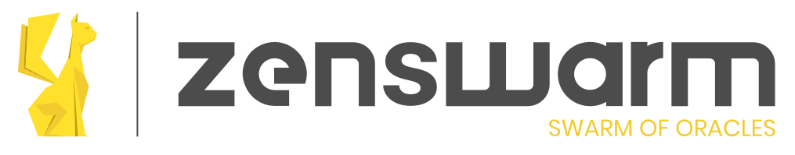
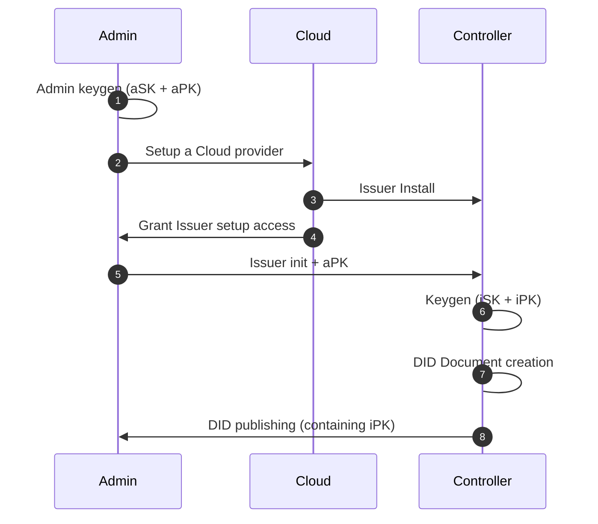
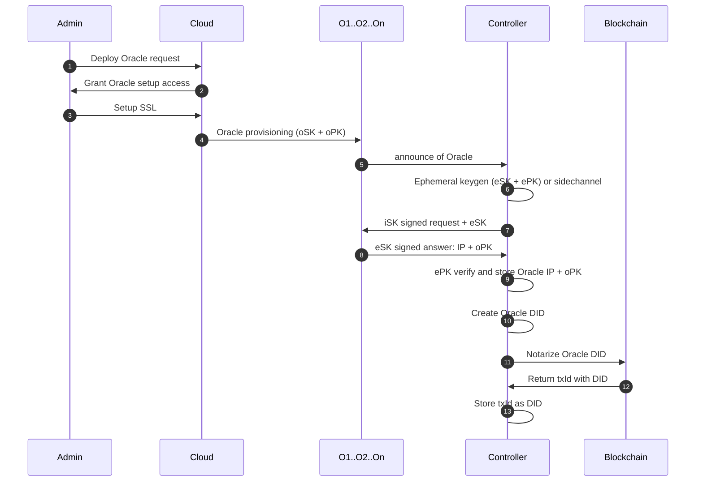
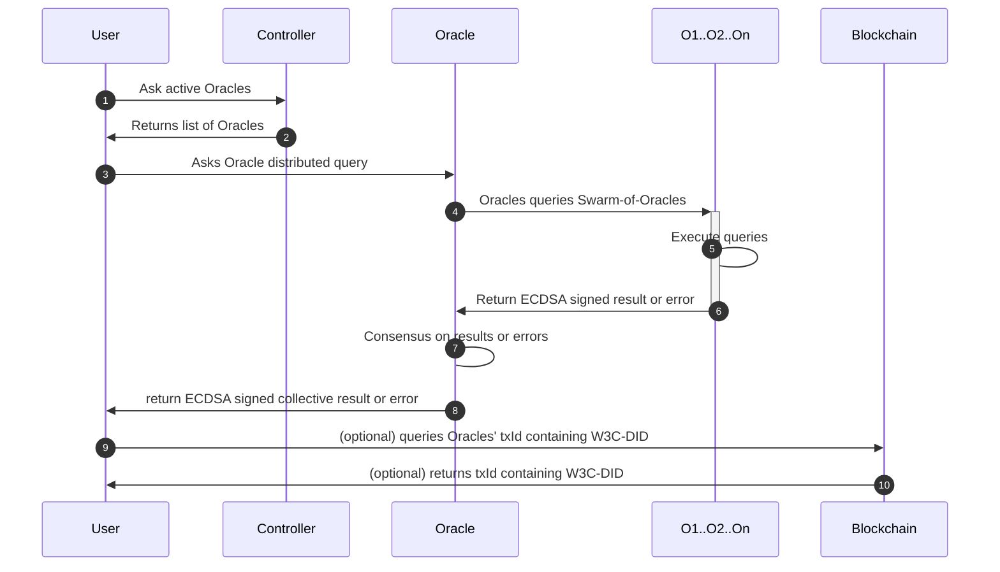
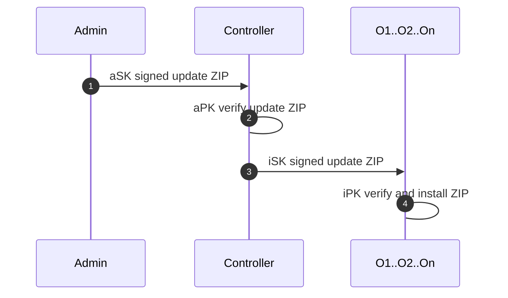
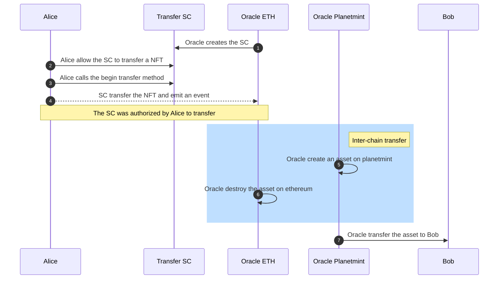

# Zenswarm
**Zenroom based Swarm of Oracles**

After announcing to a DID controller, the Oracles provide a number of services, including:
 * Cryptographic signature
 * Blockchain notarization
 * Smart Contract execution

<h1 align="center">
Zenswarm
  </br>
  <sub>Zenroom based Swarm of Oracles</sub>
</h1>

<p align="center">
  <a href="https://dyne.org">
    
  </a>
</p>

<br><br>


<details id="toc">
 <summary><strong>🚩 Table of Contents</strong> (click to expand)</summary>

* [Install](#-install)
* [Monitoring](#-monitoring)
* [Diagrams](#-oracles-diagrams)
* [APIs](#-apis)
* [License](#-license)
</details>

## 💾 Install

### Requirements
*  Linux based machine 
* the hostname on the host machine, must be reachable from the internet (can be an IP), the oracle use the hostname to announce their identities to the Controller
* Ports between the 20000 and 30000 must be open on the host machine
* On the host machine, add to /root/.ssh/authorized_keys the pubkey you will use to deploy from your workstation: ansible will use this pubkey to obtain root privileges on the host (not required if using the Linode scripts)
* Open an ssh port for ansible, can be configured in hosts.toml (default: *ansible_port=22254*) (not required if using the Linode scripts)
* The Oracles' ansible installs an SSL certificate using Letsencrypt and the oracle currently comunicates via https. This can generate issues on machines behind a proxy (e.g. a virtual machine).  
* (DID-Controller only) redis running on port 6379

### How to install

* *git clone https://github.com/dyne/zenswarm/*
* edit hosts.toml to set: 
  * address of target machine for deployment (default: zenswarm.zenroom.org ) 
  * port that ansible will use to connect to the host (default: *ansible_port=22254*)
  * amount of oracles to be deployed on that machine (default: *nodes=3*)
* edit *./ansible/init-instances.yml* in case you want to use a different DID Controller to perform the announce and deannounce (defaults: **announce_url: "https://did.dyne.org/api/W3C-DID-controller-create-oracle-DID.chain"** and **deannounce_url: "https://did.dyne.org/api/W3C-DID-controller-remove-oracle"**)  
* edit *./ansible/subscription.csv* to define which Oracle will notarize from which L1 to which L0
* **make setup-tls** to install the SSL certificate using Letsecncrypt
* (If deploying on Linode): execute **make one-up IMAGE=(name of the linode image)** 
* (If NOT deploying on Linode): execute **make install**

### How to run
After installation, run:
 * **make init** to generate the secret keys of the Oracle(s)
 * **make start** to generate the identity and trigger the announce of the Oracle(s)
 * **make kill** performs a graceful shutdown that deannounces the Oracle(s), unregistering the Oracle(s) from the DID Controller

### Announce and Deannounce process

Once an Oracle is deployed, each Oracles tries to *announce* to the W3C-DID controller. In this stage, the Oracle will communicate its pubkeys, its version and some metadata. The W3C-DID Controller will register a DID per each Oracle, and store the DID-document on a database and blockchain. 

Upon graceful shutdown, done via *make kill* from your workstation or *pm2 delete [instansce-name]* on the host machine, the Oracle will *deannounce* itself, which will prompt the W3C-DID Controller to remove the Oracle from the database.

Specs about the DID implementation is in [Dyne.org's W3C-DID](https://github.com/dyne/W3C-DID).


## 📉 Monitoring

* On the machines where the oracles are deployed, use **pm2 list** to see how many instances of restroom_mw are running.
* A GUI-based monitoring service for the Oracle is the [Zenswarm-Dashboard](https://github.com/dyne/Zenswarm-Dashboard). The GUI retrieves a list of the active Oracles from the W3C-DID controller


## 🖧 Oracles diagrams

Below a list of the main Oracle flows involving:
 * Controller provisioning: provisioning of the DID Controller producing signed DID Document for the Oracles
 * Oracle Provisioning: key issuance, DID document creation
 * Oracle consensus based query
 * Oracle update

## Controller creation



1. Admin is the control terminal and generates a new keypair (aSK + aPK)
1. Admin sets up a Cloud provider (one or more) can be remote or on-premises
1. Issuer is created by the Cloud provider and installed with a signed OS
1. Cloud grants to Admin setup access to the Issuer
1. Admin initialized the Issuer machine with signed scripts and the Admin public key
1. Controller generates an issuer keypair (iSK + iPK)
1. Controller generates DID Document
1. Controller shares its DID containing (iPK)


## Oracle creation



1. Admin orders the creation of Oracle to the Cloud provider
1. Cloud provider grants the Admin setup access to deploy the Oracle (IP + SSH)
1. Admin set up SSL certificates in Cloud
1. Cloud provider creates the Oracle on the host machine, and generates keys (oSK, oPK)
1. Oracle announces its identity to the Controller (URL + oPK)
1. Controller generates ephemeral secret key (eSK) (this step can moved to a side channel)
1. Controller sends eSK signed with its private key (iSK), its public key (iPK) is known 
1. Cloud verify signed eSK and signs it with its private key (oSK)
1. Controller verifies eSK signed from Oracle using Oracle's publick key (oPK)
1. Controller creates DID document for Oracle (containins DID of future txId), DID id is oPK
1. Controller notarizes DID document of Oracle on Blockchain
1. Blockchain returns txId storing DID document Oracle 
1. Controller stores txId as DID document (txId DID is contained in Oracle's DID Document)


## Oracle distributed query 


1. User queries to Oracle Controller requesting list of registered Oracles in the Swarm of Oracles (SoO)(or an event or a time trigger)
1. Controller returns list of registered SoO
1. User makes to request to one Orace to perform a distributed query
1. Oracles queries Swarm-of-Oracles (SoO) chosen from a trusted random
1. SoO perform POST to endpoint
1. SoO returned ECDSA signed output to Oracle
1. Oracle verifies output and signatures of SoO
1. Oracle returns ECDSA signed aggregated output of SoO 
1. (Optional) User queries blockchain to read notarized DID Documents of Oracle(s)
1. (Optional) Blockchain returns DID Document notarized in tx

## Oracle update


1. Admin signs and uploads a ZIP with updated scripts
1. Issuer verifies the ZIP is signed by the Admin
1. Issuer signs and uploads the update ZIP to all VM
1. VM verifies the ZIP is signed by the Issuer and installs the scripts


## Transfer Ethereum NFT to Planetmint asset


Alice sends an Ethereum NFT (ERC 721) and Bob receives a Planetmint asset, using a double-escrow approach. The NFT and the asset represent the same non-fungible token:

1. A smart contract (SC) is created on ethereum, in its constructor, the account of the oracle is set as `the owner`
1. Alice allows (approve in the NFT terminology) the SC to transfer an NFT (the one she wants to send to Bob)
1. Alice starts the transfer by calling a method on the Ethereum SC
1. The SC transfer the NFT from the account of Alice to the account of the oracle on ethereum (the SC sends the NFT to `the owner`) and emits and event, to which the oracle is listening
1. The oracle creates an asset on Planetmint which represents the same object as the NFT he received (using a `CREATE` transaction)
1. The oracle destroys the NFT on Ethereum
1. The oracle sends the asset to Bob (using a `TRANSFER` transaction)


## 🌐 APIs 

Below a list of the APIs available on an Oracle

----
### Get Identity

  Returns json data containing the Oracle's identity: 
 * Identity
  * uid: contains URL and HTTPS port 
  * baseUrl: the URL 
  * HTTPS port
  * ECDSA, EDDSA, Schnorr, Dilithium, public keys
  * Ethereum and Bitcoin address
  * List of available APIs
  * Country
  * State (region)
  * subscriptions: list of blockchain(s) the Oracles has a websocket subscription to
  * L0: blockchain the Oracle is notarizing onto
  

* **URL**

  /api/zenswarm-oracle-get-identity

* **Method:**

  `GET` or `POST` 
  
* **Data Params**

  None

* **Success Response:**

  * **Code:** 200 <br />
    **Content:** 

```json
{
  "events_subscriptions": [],
  "identity": {
    "API": [
      "/api/zenswarm-oracle-announce",
      "/api/ethereum-to-ethereum-notarization.chain",
      "/api/zenswarm-oracle-get-identity",
      "/api/zenswarm-oracle-http-post",
      "/api/zenswarm-oracle-key-issuance.chain",
      "/api/zenswarm-oracle-ping",
      "/api/sawroom-to-ethereum-notarization.chain",
      "/api/zenswarm-oracle-get-timestamp",
      "/api/zenswarm-oracle-update",
      "/api/zenswarm-oracle-get-signed-timestamp",
      "/api/zenswarm-oracle-sign-dilithium",
      "/api/zenswarm-oracle-sign-ecdsa",
      "/api/zenswarm-oracle-sign-eddsa",
      "/api/zenswarm-oracle-sign-schnorr",
      "/api/zenswarm-dilithium-signature-verification-on-planetmint.chain",
      "/api/zenswarm-oracle-execute-zencode-planetmint.chain",
      "/api/zenswarm-post-6-rand-oracles.chain",
      "/api/zenswarm-read-from-fabric",
      "/api/zenswarm-write-on-fabric",
      "/api/zenswarm-read-from-ethereum",
      "/api/zenswarm-write-on-ethereum.chain",
      "/api/zenswarm-read-from-planetmint",
      "/api/zenswarm-write-on-planetmint",
      "/api/zenswarm-oracle-verify-dilithium",
      "/api/zenswarm-oracle-verify-ecdsa",
      "/api/zenswarm-oracle-verify-eddsa",
      "/api/zenswarm-oracle-verify-schnorr"
    ],
    "Country": "FR",
    "L0": "ethereum",
    "State": "NONE",
    "baseUrl": "https://swarm1.dyne.org",
    "bitcoin_address": "bc1q6hygvxc3szryv7gm3tz45t0jteexhfn3ttnkr5",
    "description": "restroom-mw",
    "dilithium_public_key": "ItLfEp0MYHZLlunATIOdjVtlMI0YdSUb7TwEcJFfyD1noDqWbdNmCW7ODIP3sWUxVP/+X+Xerw+mgCxulAiuU4k1Jc3LtliYuXIjmGr8O+SyIwLKnEmi7Vv4hxT0PnubZHEnlipovn298+Fibas4/GgP4c5b3omzZuZXAJ/ncwbuOLbs4XaJckNWEK9Gkq+WiNjCu0mnd5ERVawXTnfi5377f63nOAj7VqSHJImc8lQ34WtLRgyGVSQySyVtEzeCWlBfzVp1+rNjPIwc+xvp8NBdeHiZdL/kzFXtagD5MkgxtFDfj5BPVyWcfs6mUnjetfz20zerHsrSe3nBCbe5pPYLtqzkIPntiNQk6LFqELQo4DwHiXOn0iulGLJlVTkKKc5hJUGLSrrWurN0heBYIkaPEgkNTuLAwWRV3rV74a18L4rsR713yYQB85oFlgXgd0vOp/BUzrTExwslq5MviwUI5m5TArSnGCGBhvpI3HXydVUw391JztvJd18r6lbtGCD1/4FUXZFVtTYFfCwAzao6fcEDa8eiqoAwzrbHUSgqE9WEbR0BxaHMBTANh7i5mnNfcdqFi/rcce7Q29Rt5gSfST7d30YMlmXrIuB2zok2GQnvWSHiFMg7eP/FSvVLMy6CXER0Vsc/f7IDjUmfVF7dDWQzVA+/4/N6aGqaesKx4vELM/ZhvALy9bxOM1e6zE2AW9taal9rrdcLQ82mD00pX0cZ2ulAYWLF66OVIl3APn4zGlKceYtvxlmMba3Qc3gzPSdyDfqaW7mI7/P9YpXphogC6N0kHcvBfQt7YB5U8KE3fG+OoqfSVDcmP/lcT+3Gi3NgoxLYzhN+m3daBpNyWBdQbpWBYYlGa5dxcPmc2G6/WhLPPPEvAZiviakxd0WJtqbeKhTkxHpORwavCzSXm10YnGXbV/JBIV//LDNclwRJ6zqiD2y1ha3XScNIyzOW8rKebsIgJHquXCn2DHLjZJggJepU4Wy9AJ2PmjeP98JS/8+n1mTlkGT+OL4dzAYn3cZRNeC1BdG/dPExwr8i53BjX/suybLLKcHRdg1M8Wh1qo36s+7Cj32oRR3gPIdhcbxmM1udlqdplHk5gUV3ZX2p47C84op+JILgSfOvm8iD8ovxE1mSxQxnHT+UjMRynk0m+kVQvEUV9vNTxHm5bgi6OrjsXOBlLolyF1PMjPXBKymOu9g0gMfpXtGYAO2uSFVCocWTLAzBn9X9zCEy9NLSLcwccvx1Ha1TpKuIj9axtPtE5h6yST/bNxSDdfDLKppkgYafBiUWa9skNMMOAKywqAa2nZXV3qaaJz2ItyJjUfd2RY3NPxh/9LwqsGiwTBSab81hCmbiP6Kto97npEvGWSkNSfO03mkooiP4+6GyzsbGqSqgwvmCUg4DYlypg+B6WC4JanKcKh/7TbZ6py4j0EWWRVjG4saXYPQvEOTEMKl2XF7EAZlkJJ+Px2ODws+fm8TxhwnQv5lYk8SNETFcYr3At1q8vkoV3oYMlsLK+JNUDeajIBvhht3UXlV1qq9302LzkKY7NaB98RYrYtnMvm9lE+rrAtpwVagKAhI9D8Ro3DXvqFcYsUq4/YrzqBSvSpCE2Hr5SJfdG0gauj3/8c8Dp48ZMSPvAEogGhio4A9p6v2tkY4jbZtZ52VqeHcvapsernTLcSze43KgQ1IZ9IsVifPJ/T4PwwGdN/wdHruerxJyuczsRkav53Ab/jqI5yRZfjok5ainBQ==",
    "ecdh_public_key": "BGKoemBeotGNDDRo5UkTt22A6JptWw8cBfNJsWqZ0a5HoJeTkJbxt8rgUkqOo01MWzlYzS4fTDLop+iKaJ4wPYM=",
    "eddsa_public_key": "DTfR61WARbLGRKKktKXFA4ju7wGPHweCWr4k6XEpYiFz",
    "ethereum_address": "d4f1a1e96bc645b546b8490061fca2ca4e4aa176",
    "ip": "swarm1.dyne.org",
    "port_https": "20003",
    "reflow_public_key": "FpQNINRts97o3vLXc29wu32xKG/FScspyjkfzipvvA9ynzlG3deSfWpu6byqn9acCHbGVKuuooDJ5zhylwCMaOsmC3wUvKbCLylaJuaroYqIu9j03ELOZamfTTerG3KdAS+DJNbnU/Qm5Qo9b3EFVvIcJEw+7SIwV5fztnC9wzy9dq2IAq1OQSQCQ69ZDRIRE5DspHik0y7ib4Qm6QRsJ3IDqt4XBKYxJAZdJ1rgsMCTdtx0YREGnOZSSILbWYQF",
    "schnorr_public_key": "Fdui5ug5o2AlRHLtKwF3j6YwYm2JVnY4aqZW6Wyse/ykGlixYUFKZLNFmBQFBiW/",
    "tracker": "https://apiroom.net/",
    "uid": "swarm1.dyne.org:20003",
    "version": "2"
  },
  "subscriptions": {
    "fabchain": {
      "api": "http://78.47.38.223:8545",
      "name": "fabchain",
      "sub": "ws://78.47.38.223:8546",
      "type": "ethereum"
    }
  }
}
```

 
* **Error Response:**

	None

* **Sample Call:**

```shell
 curl -X 'POST' \
  'https://swarm1.dyne.org:20002/api/zenswarm-oracle-get-identity' \
  -H 'accept: application/json' \
  -H 'Content-Type: application/json' \
  -d '{
  "data": {},
  "keys": {}
}'
```


----

### Ping

  Returns json data with a string.

* **URL**

  /api/zenswarm-oracle-ping

* **Method:**

  `GET` or `POST` 
  
* **Data Params**

  None

* **Success Response:**

  * **Code:** 200 <br />
    **Content:** 

```json
{
  "output": [
    "I_am_alive!"
  ]
}
```

 
* **Error Response:**

	None

* **Sample Call:**

```shell
 curl -X 'POST' \
  'https://swarm1.dyne.org:20002/api/zenswarm-oracle-ping' \
  -H 'accept: application/json' \
  -H 'Content-Type: application/json' \
  -d '{
  "data": {},
  "keys": {}
}'
```

----

### Get timestamp

Returns json data with a string, containing the timestamp fetched using the JavaScript method **getTime()** from the host machine

* **URL**

  /api/zenswarm-oracle-get-timestamp

* **Method:**

  `GET` or `POST` 
  
* **Data Params**

  None

* **Success Response:**

  * **Code:** 200 <br />
    **Content:** 

```json
{
  "myTimestamp": "1656931966016"
}
```

 
* **Error Response:**

	None

* **Sample Call:**

```shell
curl -X 'POST' \
  'https://swarm1.dyne.org:20002/api/zenswarm-oracle-get-timestamp' \
  -H 'accept: application/json' \
  -H 'Content-Type: application/json' \
  -d '{
  "data": {},
  "keys": {}
}'
```

----

### Get signed timestamp

Returns json data with a string, containing the timestamp fetched using the JavaScript method **getTime()** from the host machine, along with its ECDSA signature, produced by the Oracle its ECDSA sk

* **URL**

  /api/zenswarm-oracle-get-signed-timestamp

* **Method:**

  `GET` or `POST` 
  
* **Data Params**

  None

* **Success Response:**

  * **Code:** 200 <br />
    **Content:** 

```json
{
  "ecdsa_signature": {
    "r": "ivjynFRQXm4EYKGwYpXSejoZvLNmEYHb3O5pFh2I+F8=",
    "s": "DWLIWDtSTxfyuKRuj2d0uIkRjKRaaJwvoBbU+qmFZJQ="
  },
  "myTimestamp": "1656932308339"
}
```

 
* **Error Response:**

	None

* **Sample Call:**

```shell
curl -X 'POST' \
  'https://swarm1.dyne.org:20002/api/zenswarm-oracle-get-signed-timestamp' \
  -H 'accept: application/json' \
  -H 'Content-Type: application/json' \
  -d '{
  "data": {},
  "keys": {}
}'
```

----

### Dilithium signature

  Returns json data contained in **asset** along with the [Dilithium QP signature](https://pq-crystals.org/dilithium/), produced by the Oracle its Dilithium sk. 

* **URL**

  /api/zenswarm-oracle-sign-dilithium

* **Method:**

  `POST` 
  
* **Data Params required:**
   
  `asset={data}`


* **Success Response:**

  * **Code:** 200 <br />
    **Content:** 

```json
{
  "asset": {
    "array": [
      1,
      2,
      3
    ],
    "dictionary": {
      "number": 1969,
      "string": "hello world again!"
    },
    "number": 42,
    "string": "hello world!"
  },
  "dilithium_signature": "Mih4ovrG/Zm2H4yj1tqGBjzpMt3bihqbaDdMK5Tc6Ba6I9R6QFv82pxLTZMhzpcglt3j9kRRX2yCmHVzPSz3uwPB4Luzdn9dFiHh7mU3XcupJaTbDpeaMRljmioacWp21w7szJ2KK6Ob8/qRUCt5JEOkpZB4FTWoItrz6KqWNtDGMsWSJalfiNoPuklcpes9lxXMQVRDtGg/Hii3rEHf7mg3IlAYZVJ2vGLQBh7OjQiUCmK29RFa49eMWhx1aImiuduEY+0gRc1yhM6jMtrgKIqt2+W2uMvF6qccoGOLgnSGtNapljesIx0W74x/3detwyuVFDeikh6Nh1SdQHbHHtCXez89anWELYLY4XwrwC86KAa609FwdPAIjlsp9OnQ4XDS5k7Okhll9kA+G8EFm8OeorzmJkTOCjsgd37KcJ10LvOHpS6Ux/PIdG8pGt816MvaYmSGG8yQWzHu3DNK2aa4hcLDDxvRCEUHW0LiXA30+/p+jmthvI9pvDq/EK1bDKltxjeWrMP/wzyYD/88b3pZ7KTbCNPx/BGg36TBChc/0xt17NeZZASiMsJLGYzJMRkiNJhRs8qowYIDXGsWJtcd3XWFOZMkSHIKRcLUn3WEFLSl/XwfqtH7mx2R/apm4/t+NO0qTg+c4511oCKUdvfV5guCPRCevjCI5EhjViAd1j8hajGWPpz5boqyvzNcPTuNNXORORm+n2pmC8ht6I2zPtXHBWvuF6QMwnxLGi7Hbx3TevGPC/Xk0C5rbVeD8vKps3gquvJ6OlizATI8UElPP4pnjzCf0hw5n3hCFw9F+aBxWAGQfEqmzfZNyLz+uH39d9j9RUPCuvOv2LBmp7GHcZfw0/7tyvlaW+n2rEXDVUNaUY/LxiVcWr/FPO7sN1pkIQkr8KK/k0ggAOlPNIPBi/bsnwwzfmbY/s/1eruZHXRzhxY31bx0ievHQmCJfDAWYyW4v3wwZ2lJVwaBRTbkViYr5qFi6aCnY2MC0rpd59dHNvFU1cf0rGS1sIdU6Q3jbDDjwRDhLsjOv4TPlQhVyGDxcPurFfHiV9zHGYI9ACf96klweCH5NNgh7kqrjTN/MN3/dDPSPimpLW50aeolKdOAZTqrZzd2yDdbm7nxmnuA9LzqOHXMRKSEi5LmeOt0l36qIG4zEteYse0ANEhyEU5w0S4BoNbQ9BWpN4u2l3P+5yOtp6clNF/Wm5mB+L1d5xTsm8293iVSwOMQAoEltd4K2dvKJFo7LcryE+zZTyVZetKHYW22RRLTmqdoOjvYXlY99CE/aj9EPANdIaTkIbcGJTuvg3ZK7Xh2GRt1on9jQWjbNA3fjrbx4y9BaNQoJAdJCfojjO8ppGU/jYT3iPtX+kWHOJuElqCwvteeLtJA6i9nLrqIgcAlkboJ2YvxgxUcCZBu44HNsN1xxudONyN8rsIy1CLLYQ+W8Rh78tY342Rsb4r9ZuBGBrqtNnG4UQu8MQ7LdXcKBWAdx3jK5L6EoxT3Go1CRb5s/i6I6tQz5aNUA6dqnKc3SjYg1cqqDg+jJaAeW1aoclWTGYILWMC9f932EGtmiveEeBNgvJUwCREMysFXM65ePDs10CeBByKytt2m+InnTqKXw0XyuCaEqISNc8oRDkxlen1/833a/2y5GszfNaA4POCwUCxHeL+a+09piOeEI0XbwoxtAAqqG9xUeWO+SS5r7O3qYeMNqdvXThCzor9ECtUomO0rc2AfiUpxpq4BO9hxmlzpfDRU347rr81/tnwfG3QF9Bz6f7ICREBq/r1rqNH1LC8v4kZuZYYdfoSfMYjckMt4nLjhc5456FxKdJgeQ/XUl2L1Nsj8IVta52mogFYZ0ZJXQFrw3j5l4JV2mnvoP8apGliGosPX3gkIV4bQNTpN2mE+oVTG+DPKf5ePai0cXaMWGJexjTRseGtg9gfUzN5yXXmEzHGOh9e/PYu7ro4GpmTVTNpmwfAGeLJieO0eGIK/UJUiWM+sGM7q1l2Lhdym0YthrgiPc4sLZfUE9thEaBUTmNm9ZtrrMcCpoDUqPpLGxhbxJx2LSiIMvHHsqFXBZ2fbPJRYHxFyTTSjnLkbC6+ds9GKIy4XkCG1tTgScF5upIpaaJ2cvMKoLvPv8uLPmrRnHb0BYvih6WDTXV6QdMX7Nw+y33CYxmmpemstodVhfKk6lKaJCqn3XjKrT0IdohdLMK9/8lWRzfoffdiRV5yAKPTMNaaoRXW86y3BEgYTIibYeePDOL1e4kFHwh6AP2ZhQKT/FvDl9+DqSYPj7wQLqzpkqjMxOdAoNC3xOS517V8sTTe0/tlG1CZnmvmcyWXYAj7UPRomRzkUrM7klQC+ctIcutofBvr5dooYx3+R5g0FTNsR0y5VYoIKp5pesGnuRtmbm9c6BB4AQAPHHwCUDfKMC+zUH5CTmyUFfH9/ercwVreMNOOpUWtAqvdtxpuy8+E3CyKgcpWCrSnFeNmeo2XZXsv4XdNu3ZUWHNjP9tw7PlT7ROx6RAjOIrqOXUyw5onzaROx3ScwY6EHwBDnjQJQ7dBeK89CdaDWrqFhkRKsKjVWhJ49aObCLnNNlHg4eLWRlL88Yu/xDha84a5KgD3ZiNAjQGlWNKhW8XrgGS8hLHiSQJeKU1QOP+B2L7b4ilLSLwOwp6ZikzkEhxi/96PYDmAqYIJMjbVQ3u0Yja39xgy5H6HKv5fAClFpptLa0nLTR1+cjHSVGP/mdAre+SiXCUnbB8tZbGGRr8zmnGgVUG2kE+9PPf5VZc/bEbxldHD2FRWJNfTq9FHekSKRnE8PORKaXJmTOTmJ8oCzdYzROv5qeSOhKzBGCnoqWhNi9Gb9DMcfr50xtwy5Ak6FZdewPAPCqSKjvWBrg1rxjMWNdoGHwPHnN8XRCpFCxf36Pr9P1dlSf/9PALbRRYCpLroxlZQR+XpZT/vulf1mULFtW5VLZ6Ma38h27mxW5V9lFXAoGfb+s394fwix0Y7sNJhlLY6ycm6HgODuSsfpSwGNhEq4+r82OUFIWa9k+Wgn4+Us4hqfN6uYqWZcerleeeheRT7qq7SP+Ywv/ZvyOO4Tw0YvIdqNguL/ZFKwqj47f0nthidP0fFehecVFy0zNUhZXoqgpqew2fAFCBEYHCsuP0BLUmt0iq+4vfELECM4OWh9vcTZ6OwCR3ydoKrDxAAAAAAAAAAAAAAAAAAAAAAAAAAAAAAAAAAAAA8hLTU="
}
```

 
* **Error Response:**

 **Code**: 500 Error: Internal Server Error <br />
    **Content:**
    
```json
{
  "zenroom_errors": {
    "result": "",
    "logs": " ***Zenroom ERROR logs*** " 
  },
  "result": "",
  "exception": "[ZENROOM EXECUTION ERROR FOR CONTRACT zenswarm-oracle-sign-dilithium]\n\n\n Please check zenroom_errors logs"
}
```

* **Sample Call:**

```shell
curl -X 'POST' \
  'https://swarm1.dyne.org:20002/api/zenswarm-oracle-sign-dilithium' \
  -H 'accept: application/json' \
  -H 'Content-Type: application/json' \
  -d '{
  "data": {
    "asset": {
     "string": "hello world!",
	 "number": 42,
	 "array": [1,2,3],
	 "dictionary": {"string": "hello world again!","number":1969}
    }
  },
  "keys": {}
}'
```

----

### ECDSA signature

   Returns json data contained in the **asset** along with the **ECDSA signature**, produced by the Oracle its ECDSA sk 


* **URL**

  /api/zenswarm-oracle-sign-ecdsa

* **Method:**

  `POST` 
  

* **Data Params required:**
   
  `asset={data}`

* **Success Response:**

  * **Code:** 200 <br />
    **Content:** 

```json
  "asset": {
    "array": [
      1,
      2,
      3
    ],
    "dictionary": {
      "number": 1969,
      "string": "hello world again!"
    },
    "number": 42,
    "string": "hello world!"
  },
  "ecdsa_signature": {
    "r": "VSWtbgWid2bMvXDVd2pemTlYb204E3+TgjhQh1nu38M=",
    "s": "EH16QToBcWVqasQ8+3uTSgklvvk6odXw/ut1KuDDHkk="
  }
}
```

 
* **Error Response:**

 **Code**: 500 Error: Internal Server Error <br />
    **Content:**
    
```json
{
  "zenroom_errors": {
    "result": "",
    "logs": " ***Zenroom ERROR logs*** " 
  },
  "result": "",
  "exception": "[ZENROOM EXECUTION ERROR FOR CONTRACT zenswarm-oracle-sign-ecdsa]\n\n\n Please check zenroom_errors logs"
}
```

* **Sample Call:**

```shell
curl -X 'POST' \
  'https://swarm1.dyne.org:20002/api/zenswarm-oracle-sign-ecdsa' \
  -H 'accept: application/json' \
  -H 'Content-Type: application/json' \
  -d '{
  "data": {
    "asset": {
     "string": "hello world!",
	 "number": 42,
	 "array": [1,2,3],
	 "dictionary": {"string": "hello world again!","number":1969}
    }
  },
  "keys": {}
}'
```

----

### EDDSA signature

   Returns json data contained in the **asset** along with the **EDDSA signature**, produced by the Oracle its EDDSA sk 


* **URL**

  /api/zenswarm-oracle-sign-eddsa

* **Method:**

  `POST` 
  
* **Data Params required:**

  `asset={data}`

* **Success Response:**

  * **Code:** 200 <br />
    **Content:** 

```json
{
  "asset": {
    "array": [
      1,
      2,
      3
    ],
    "dictionary": {
      "number": 1969,
      "string": "hello world again!"
    },
    "number": 42,
    "string": "hello world!"
  },
  "eddsa_signature": "3E7obC3UDtVsf5v8c52pYbqv39pJeFHGyFbqnK2shZdmtPB3EjfpwAKwYdZ8jrDGe6buHXUDvD9ZVeADLErLdMv6"
}

```

 
* **Error Response:**

 **Code**: 500 Error: Internal Server Error <br />
    **Content:**
    
```json
{
  "zenroom_errors": {
    "result": "",
    "logs": " ***Zenroom ERROR logs*** " 
  },
  "result": "",
  "exception": "[ZENROOM EXECUTION ERROR FOR CONTRACT zenswarm-oracle-sign-eddsa]\n\n\n Please check zenroom_errors logs"
}
```

* **Sample Call:**

```shell
curl -X 'POST' \
  'https://swarm1.dyne.org:20002/api/zenswarm-oracle-sign-eddsa' \
  -H 'accept: application/json' \
  -H 'Content-Type: application/json' \
  -d '{
  "data": {
    "asset": {
     "string": "hello world!",
	 "number": 42,
	 "array": [1,2,3],
	 "dictionary": {"string": "hello world again!","number":1969}
    }
  },
  "keys": {}
}'
```

----

### Schnor signature

Returns json data contained in the **asset** along with the **Schnorr signature**, produced by the Oracle its Schnorr sk 


* **URL**

  /api/zenswarm-oracle-sign-schnorr

* **Method:**

  `POST` 
  
* **Data Params required**

  `asset={data}`

* **Success Response:**

  * **Code:** 200 <br />
    **Content:** 

```json
{
   "asset": {
      "array": [
         1,
         2,
         3
      ],
      "dictionary": {
         "number": 1969,
         "string": "hello world again!"
      },
      "number": 42,
      "string": "hello world!"
   },
   "schnorr_signature": "GO2MvxSUezuUGnNXJ8715MisUCn+bXzjISI311MhdWiXTfilahlFwUkwqFQ1MvBMBD/sA52Jq3h4T5zFMzSaZJfsMQZeTrJ64fG38oBw4Qw="
}

```

 
* **Error Response:**

 **Code**: 500 Error: Internal Server Error <br />
    **Content:**
    
```json
{
  "zenroom_errors": {
    "result": "",
    "logs": " ***Zenroom ERROR logs*** " 
  },
  "result": "",
  "exception": "[ZENROOM EXECUTION ERROR FOR CONTRACT zenswarm-oracle-sign-schnorr]\n\n\n Please check zenroom_errors logs"
}
```

* **Sample Call:**

```shell
curl -X 'POST' \
  'https://swarm1.dyne.org:20002/api/zenswarm-oracle-sign-schnorr' \
  -H 'accept: application/json' \
  -H 'Content-Type: application/json' \
  -d '{
  "data": {
    "asset": {
     "string": "hello world!",
	 "number": 42,
	 "array": [1,2,3],
	 "dictionary": {"string": "hello world again!","number":1969}
    }
  },
  "keys": {}
}'
```

----

### HTTP Post

Returns json data containing the result of the POST performed by the Oracle 


* **URL**

  /api/zenswarm-oracle-http-post

* **Method:**

  `POST` 
  

* **Data Params**

  `post{data={data to post}}` 
  
  `endpoint={URL}`
  
* **Success Response:**

  * **Code:** 200 <br />
    **Content:** 

```json
{
  "output": {
    "result": {
      "User123456": {
        "keyring": {
          "ecdh": "a5b0Zw3RNUlUcKk9ZSmt53uesVJW5PHQ8gcKISbQjvo="
        }
      }
    },
    "status": 200
  }
}
```

 
* **Error Response:**

 **Code**: 200 Error: Internal Server Error <br />
    **Content:**
    
```json
{
  "zenroom_errors": {
    "result": "",
    "logs": " ***Zenroom ERROR logs*** " 
  },
  "result": "",
  "exception": "[ZENROOM EXECUTION ERROR FOR CONTRACT zenswarm-oracle-http-post]\n\n\n Please check zenroom_errors logs"
}
```

* **Sample Call:**

```shell
curl -X 'POST' \
  'https://swarm1.dyne.org:20002/api/zenswarm-oracle-http-post' \
  -H 'accept: application/json' \
  -H 'Content-Type: application/json' \
  -d '{
  "data": {	
      "post": {
		    "data": {
			    "myName": "User123456"
		}
	},
	"endpoint": "https://apiroom.net/api/dyneorg/API-generate-keyring-passing-user-name"
},
  "keys": {}
}'
```


----

### Execute Zenroom on Planetmint

Executes Zenroom in Planetmint, Returns json data containing Planetmint fullfillment and transaction id. Zenroom script is passed in the post, in the example, the script verifies a Dilithium QP signature.  


* **URL**

  /api/zenswarm-oracle-execute-zencode-planetmint.chain

* **Method:**

  `POST` 
  

* **Data Params**

  `asset={data}` 
  
  `data={data}`

  `script={zencode}`


* **Success Response:**

  * **Code:** 200 <br />
    **Content:** 

```json
{
  "output": {
    "result": {
      "success": true,
      "tx": {
        "asset": {
          "data": {
            "houses": [
              {
                "name": "Harry",
                "team": "Gryffindor"
              },
              {
                "name": "Draco",
                "team": "Slytherin"
              }
            ],
            "number": 42
          }
        },
        "id": "469481d390dbdb53cf718481b47a65b677f038d89951e14609e87a58fa784409",
        "inputs": [
          {
            "fulfillment": "pYIVMYCCAW9TY2VuYXJpbyAncXAnOiBCb2IgdmVyaWZpZXMgdGhlIHNpZ25hdHVyZSBmcm9tIEFsaWNlCkdpdmVuIEkgaGF2ZSBhICdkaWxpdGhpdW0gcHVibGljIGtleScgZnJvbSAnQWxpY2UnCkdpdmVuIHRoYXQgSSBoYXZlIGEgJ3N0cmluZyBkaWN0aW9uYXJ5JyBuYW1lZCAnaG91c2VzJyBpbnNpZGUgJ2Fzc2V0JwpHaXZlbiBJIGhhdmUgYSAnZGlsaXRoaXVtIHNpZ25hdHVyZScgbmFtZWQgJ2RpbGl0aGl1bSBzaWduYXR1cmUnIGluICdvdXRwdXQnCldoZW4gSSB2ZXJpZnkgdGhlICdob3VzZXMnIGhhcyBhIGRpbGl0aGl1bSBzaWduYXR1cmUgaW4gJ2RpbGl0aGl1bSBzaWduYXR1cmUnIGJ5ICdBbGljZScKVGhlbiBwcmludCB0aGUgc3RyaW5nICdvaycKgYIMt3siZGlsaXRoaXVtX3NpZ25hdHVyZSI6ICIwTVN1VlRHaTZORzV6c2ZKRFdVU0dEeUE2NUhWaVNMc1krcnl1T25ZOEFiWm4wRjd2ZjBMTUNVaG1wM2xiZ3VBOVZHYVAweXZZcWp4KzRCTkQ2V1NSbHpRa0phbk5RK2V1RHVXS3FKZHh1M2FnYzM5UGxqTitQUGgwOWxCRXBWVHNONlhaNzYrZVhmSzdFVytWd0dCc0Y3RGQvSU5KYWZscXEvNDZRakZ4bUlITHYydU9PeTVNTEpXYlFrMlJqc1RyTjdRRVVFQ05GN0FDWGlhbExZZXp6TWpqaFJVY0tqMkhGTHNQejFrcjRPcWxtMlpXb0tISzRjZXFCVUQrZ1ZlM1MvTm9WK1c1RDhvVVd1OW5NTDQ2UFQ5dTN3NGo3dTBFTzdJVXMxWmRaT2YyY1pBbHpHMmpIT0FLd3JrNlBtek9tQ1hSZ2lKZ1I1eTZFUENFb0ZBY0g2SGNTbUFpUXF1VUV4dURvZi85cFNGSXJHamZ2OXVOV2xPdzQ0c3VqWVphdkNNQnNxRlhzWFJUdDYvcWpnYkVwU2R6ZXJteU9VTmxqd2hWa0lUNXFvMHVYVE5EWnUxQVlqRlYvdSswQnBtb21JZHJ6UnhKcGJiVk1OcVgwQlhEREhZTlZnQVlmbUpZR3duNVE4UWVBNS8zN1Z2TXRqc2ZGenNVM051eFo2QnROTXdhWTh0elNYNmJjTE4zdGN0YlRZb0pKbDZnVEFxVFM3ZHVTVkZGMGpCNG9BM0luSDVkd2JPcjNBMEtoUEYrN0JyMll1U0EzTzErdFJPVGpNaGRCTXlCRDZSUjRWR0lFaTR0K05GbFR5YWxXUW9NaStBUGxnK2F5cjB3TDhWQ2grdHREWFRCc1huYkZ5NlBuUkpOUkE5UHo5VExnc3pwYUFmZUgzeisrRFRXbVJCOVpqaHRWdzBCb3BmN2lWaXYxaGZ0d1ZVUERJM2VQdzdFMjJKVjF4THRMQUd4dUhlTUhUT3QvSHkrZzUxdzMySGpFcVd5Qm9oYWRpQkxaYWxxdHhTWGJlV216YlkwMnQ1K0FQV3pFcXdJekFWSjBnMXI2Q3ZiMGNRMXV5SjhZazZDYS9xQjZvOHpZcWRyTDNHVVY3OVUxb3NORFl1cFZTTzg0TzRxb0drQWo2cDd6LzJtVi9QMkhha2YyVUxPU1RaaEhUODkvQ29vc3FQek5QanJsQ2hzbk5NWWgySGRFUG5ZQmRibGJHWlo3ZTlBS3JxWGQ2NUFJbU01VTIrU2dobGhKbkdNOWFOdSs0WTJwa1lZM2hlT1RUY09Pbm9xUk5adGVqYzV4RmI5MHZjUDJDN2s4RllvOXZRMG1jdFdRMlFUZVRRbm92Sko1S1ZPNUMxdnZUL1ZDcFNoUlpMNUYvcnhoOXdCMGx4L1BoSEtZSG9qZkVVd3YwTFYxR3llUGZhZ1VVTVMyVkJ3VFR3cmhOdzhhN2oxVUdxT1I4S0hpUXhnRHEwamo5bjd2RlZSVzdwaVZ1SjRBMWdEUkpZMVM0OVJYVC90a2xRb0RMQWZGOVN5ZEVEbVFmak10UFVQb3NadW5nK2gxMk9qVFE4eGhoeWM0WEVYQ0RMRUtOcS92bzlPeEFRUkJhL0lGVTFBa0FiZkpsQnVFVGpGMVlmbFE3M09xVG0xVHQxbEVpRkp6SkgxZXRGZU5GNWxES1Y2SlVQa3B0UHRZaTgyZXU5MWUxbDBFcE1GRU9XRlpqZnV1cXBJZWpCV2ozNWpqRUFiRXN4cFo4WlpjR25GbnBHZ09TWklFWVJkeEw4ZE1CSVBFVjBJUkxDR3VZU2hDWitGeTd1cEFjZTMxUEdJVDZ2Q2FvU3hoQmFNOHpiTWpkckd0ekJHU3dpams0aUZiRmVSbVFRTWg0SjlqcTVnYVFIMWE1amdEVnFJYllsT1RXME9aaDlZcHFPTW9TU1lUejlYUlFvQVBGYjQ2aTd5dWRjTE0zL3NGakpEWGNJT0ppUWlTN1ZIdFJqaTEzb2dQRG1MYnA3Z1hMdldQVzg5UmQzK3h3emhob1V5eWE0YzQ1SjNTc0U5bE4vT2pMWmlVaEh5bU5qWjEwZGc5SU1sL0ZjMmlmYmh1WCtYZDB3dFVCOXpJSmgzSFdMVGxsTkYzY3pRUGx0bit5cnJVK0tlZmVxRjAxUDhXaDQ5dDZxZENTb1diZ2puMGR4M1lrYURMTCtHcnRSNjIzM3hWdHpMSFZzaXFxVzEzYVQ5SmF6elFGNzdqdk9zdm0vdWdGOU1pdHl3MVhmMHNqYUZpWUJFL1RWRVRlemVKVEQyekNmOWYzMWFRTXpUNXFRVGI3dEJUUE90cENnZFlpQUY5Snl1YU5WekVKRUFYN2pqS2ZTaXg0bDRKN0xuVGNJZGRaZ1FBTXdqMW9MdHJqRXZXQm9Xb1NDNEdKMWs3OFhqY0hhSHRtdGxvTmRNM3dKTGJ4WTF4bC80UkNEb2ZZK2d5eTRsNjVKbTBzSHZqOVZmMUl2M2tycjAyZjhoNDBCa0Eva2tkdEcxdU9yT0hpNkNsZld0VGR3djhGUW4vSm1xM0wxU0VscTNPWGtLeWpYTjBLUnRJbml3dHgwRGFtSXZXQzRxay9jOGl6Mi9YOElVVjRiQTBObUw3ajRHVDRqbThlYzJ0ay9UbExacFRVUTFGVWVaNHF0aHpXRXJDTDdSUGJ6N1FXbFVVcm1ibE1Vb1luZVlHLzcxMjlhdVBvT2hleUFoR1djRUtGK0FNamtCWTl1anBMNGlreTYzZlcrK21kVUo4UVBKaUVtdElJWVBDWUJjV3drMXdEcTIrRlU1VDk0YmRQRTZlSnJwSVVLUW5sK0pJaXF5M0preFVtNms4YTkyZHM1Z2YxQXp4UkpEdU9IMkowV2FVQXNSenk5YzV1ait6dXJCcURuM2s3Z3VHQmZIKzFzZXZoR25neXRRWTFtWm11QUkxSzJPNU5OSWJlaHhPZ2I5NHlCVTdNVEFnUy82dDJDVi9naXRLQThuVWpsOStxcExWZm5Dd2ZYMWJpYTZwVkxPWUJaSlM2WDNNVUVCVFJXK2ZaenZubVVITDJjVHFNLzVIeXg2NDZucmE3NVU0c1pKck5Qd3FqWG1DQWNyN2xVaGZOcWMzeDJSdnBFRTdHMm5NdzZTRUFFTGJQaTladXJBWGZaNDNUc2tVa1UyakRqSlRzRHRZZkw1bXpUWnh1ZmdEbnBFYmR1TzdoTHJRdHVUY2Rydm01YVhXaWx2WXJ3Rk81RXhST2NjWitBUXJMcnFhTXVuVmhwT24vMXhXSkN4cEkydlBTOTFJY050UlAwZ1k5VGtlWUdqNGRuTFdjMnpnc0k1UGY0YVRXNUl3ZzlTejhJVERQazFBZ3VJaEhJWVZ6cXJETEUybkR6WU0vODI4by9hQzN0Rkw3blUrd0t2SlBya2xBQldWNlFwLzhvbGI2WFdwN29GVkFrMzFyS1VDaEJaSU1uY1RDNzJmZTY4RS8xWGNlN0RYQis5Wmg5QVJic0xscWdiUDAxOWlYZmN0K0NTSkQ5aS9RbG0xVVJMR0krODZORFFoZVIwQ0w5QUdpR2ROQ21LSmsxUjVyVFFxdE5ZRFp6allVcG9GZ1l4MGx1ZllZVVNhTVNuc1lsbEhqSDlIcHNWNGZLQXJ2VU1Wc00rOThmQmk0T0czSURiQ0FKWlh1OGVDN0FRVmV6UmxLOVdoZkNRZ3dkbE15aVJUVWJhRy9lR2s2c2FWWm1CZ0w1eVVHbUFpZ2VrQ1BCa1ZvQlBpYXBHemVnK05TVzYweVNZcTFIU0VnNmtFWW9leXFiTmwrbkJCeGZtb3U1QUNEZUI1RFdsbmRqZktCMTduQ0lXWjFVL2hqVjdBbWxsWllZVWNsSVBaRStiTGlpODNxWHlnVFJEeUNQVktFcHNYRTh5OTN1VWNkZUg3Q0dNWk9OYmw4Rk5FR0dKc0MrVEpudVUwVHZKNjFtcnF4UE1xenNsQWxMZ1VrcGhhRjhHbittcXpoaVg3NXlEYnFJZE1oS2x5VDFWWnJ4ZFZZSTU5WklJMnpJMTk1Ylh2cnV1ajJDd0hzTW1iKzFscHFPanZYRXc4UkZNUFh0eG1hSzRXcE5YL0hIOEIxQjJTbEhTQXk0MU9HMUpCR1Z2TGkrRTJsblE0ME03dFVEWlh3Vkl6QTFPa0ZaWTJpRWhiM0p5dUx4QXc0YlhGMWplb1dPd3VEOUZFU1BuNlNtckxUUDZQUDVCQ0FqSmo1QVEyTnNrWnFidGJyYzRlTHY5Z0FBQUFBQUFBQUFBQUFBQUFBQUFBQUFBQUFBQUJBY0tEcz0ifYGCBv97IkFsaWNlIjogeyJkaWxpdGhpdW1fcHVibGljX2tleSI6ICJ1b0dONnFLQnpRZk5PZjRtK0ZxTTc3UVlnQXRwR1JxNjVXNTh2amhaOGhzSkcwZXVzUC9RazdBL3dTdkhIN0pVNzQ5aklnNGpidnVGak91Z1oyUG5uTkxvd1VlRmk5ODNscmt0ZWtZbXp1M3NJaUhFZlB2UFE0WURkTGhIdEZJNnFyVzF6T2s2TXp6VUxvQndQOG5IajJJRXA5UEpQNUU0WUVwVFE2NnRFY1RROWtyZitXdHBneWkwNy9GOVo0NEdtdUpqN0I4Z00xL3M4R0F5NTc2VkNPaHY2Myt6a29MZTFpYW12Y0ZkdGNVU3VYWmJTaldHQzJhYjd3WkwrSWM2OCsxdVUvbGl5WHdvSW4zMDdSM29NWGdNbGdUVFh4dEo3eWEzN1dkbkJKNHBrR3Y1WUxOMEtIV0REUFd2V0ZjcWMzM2pNTTJXVWVpbEtJN1pIeHIyMk9RRFZHVmFxYmZzVEhCaXpjSlZESjUyTjZDYU16ZWg1c3FPRDlEZzV2Y01kT1dQTUxMRHF3U2ttL0VhU2RQSzZzSy9oSVFLbmpwcm02VnluemswZGlocjdWSVdFb2wxSWxnVEJBY1BUNFZOTlJZU3FDbVo3VGdlZXFPZ3lWeUE5MnJNazhJaHhuWW5RNGRnNnRVZmpvVGxsaWE5WmZCWWdiNW4wRW54OWdROHY3c1hHT0RlcjZQdzhHSzYyaFRsMiswY1lmOHBOb0NjVHZxckhXOXM0ZmtkZENyUXRQVTdHVUZGUkZqOVBMamVyNVB1VEtZTnNJTGFFMmRlVS9zZXJoTDVBSFZwamt4K0NUYmpnMURkMVdZL01wNVM1QkEvSkhYWnRocFMyeGFUMko0bUJhenhOWEs0NkxxV1EvT3J4Q1ZGTFpxM2tJd0l0Z1hwM0wxYmg3N0FkZHVlWHBJOFRCMnk3bzE2RTY0Z212aHRwQ0cxS2FkbWRUYkQ2SzVhMjZUQ1owMGRKRFNYRFI3c1QzOFBtUVBua1dheDMyYWlVVGFzT2gveXZhSnRmc1BvMUZxM0x4WDd4S1JZQ2pOTHQ3UWRsTjlxZWdoMXBnOXlac1Q2NkpqL0FIZ3d3SGNJcE9Ib3dJNjhhaFlmYmFvQkVUMHljdUFSTjQ3Y2kyQUJaZmNZcFFIZy9oRmRpcXd3Um5RMUx1ZHlhVDk5QmozMkZFeVFEV1ZwOHhEUGd3Z3RKNy9Fd0lSQTlaNm45dmx1Yk1hZ3lhdWh3YmtUSEJJZy9BYUZDYjZsSUMxRFpIMFFRc1NRYVN6Sk9nbmZ1QldsU1BxMXMyblZKUzRTYkhSUGVHdWtJLzJUZXkvUnNqMzRuZGlrTUJJV3haaHA5TWcxd0ZrcC82M21Xbm5ET2JOc3MwMitFdmRzd29hbU41d08vSDJGS3VPN20wNE5MOHIvOFZMa1cxdVdEaFVFNTVERGk5ZHVpZC84V1N5dlErUmtkS1dWMkxzUm1XaHZBaWRjUGlTS2pDUVZSY09CYmtsUkFnTnNVWTQ0aUZYMUJ5UG92S1NGTHdhTlJ4VDhHbWFsd25aQ3lBOTlPQ2taRHBrUUZnSUt2VFFBVDZZVkQ2UysySUo4YXk1SmZhdnJRWm1CV3RGeUVETEJKWTFKUGdDOUlxUjRqRDFlRUpBMmNmQ05PZm5uVHJSZWw1WWRZczBEajJKTlM1cnhNWlNseXBIUkR4WG5jcXhIcDFEYXhRU0NDSDlmKyt1cDgwWmh5ZXpZR0hONWRtUWJhdE5OUjRTeVorNUF6Z1dkKzBkalNSUDdLSXlTenc3c1JjOVZPdE9aYWlZV0o5VkxXQldPV0lFcko5bExqeHdPRlFXRkxUNnBnd2RQcmw2SUNxMGJmaGM3MlQxNW1RQWdTckhIc1hYYTFyUUxPbDFoUHBWK1VBMC9ZdXdZSzNzLzZrTVZuU0RadUkxYzRDanlKQ1BvbUNaU0NVeTk0bmJwQUZ2MTNkRWRPS2RqT0NZdno0NDY0NmVvbVZNeGxJSFBuK3ROQkpEWWNyMGg5NC9UR1ZhaW1wenY4MnU4Q2dlbnZMK0VOWVEwQkRmNkVvd3c0V3hWQzgvMlhmSjJ5ZGNkMnRUVUIyd01UZ3FBdFluUUg3Tm5zd2xGSFdWZlhndXhwL0pRMENUcExkQ2JXbG5GYlRNVVVFYjNmdW9Sa0J5b0VrL0d0NjZaSkdFNU45Q0N2dHEvZVVpNUE1OFAxL3RjWUM1ZTFJYlJxUnhoRVo2RkRnam9uZHNXS3IweXliQWs3ZXJXM0hGZlNaQnJ0dXV1SVd0TjdKc0xmQVc3WGdxUnVQVHhKci9EUWcxeGZRMU9uMEE4WC9sSHpBPT0ifX0",
            "owners_before": [
              "5Uv4KLinWJpKFagfab9r3P9jMRJhWMZv3CgRdBZZ4vvb"
            ]
          }
        ],
        "metadata": {
          "data": [],
          "oracleTimestamp": "1657027260276",
          "result": {
            "output": [
              "ok"
            ]
          }
        },
        "operation": "CREATE",
        "outputs": [
          {
            "amount": "1",
            "condition": {
              "details": {
                "public_key": "JLmXctACFNiYRMatskgW2AM8nJa93kxonqYB21mDxMDkhajmrJRogWZfJfhs",
                "type": "zenroom-sha-256"
              },
              "uri": "ni:///sha-256;M5IggboqrqqJiPNo13xwJ2Ov5K4XCOgLam79EAGIYSE?fpt=zenroom-sha-256&cost=131072"
            },
            "public_keys": [
              "5Uv4KLinWJpKFagfab9r3P9jMRJhWMZv3CgRdBZZ4vvb"
            ]
          }
        ],
        "version": "2.0"
      },
      "zenroom": {
        "data": {
          "asset": {
            "houses": [
              {
                "name": "Harry",
                "team": "Gryffindor"
              },
              {
                "name": "Draco",
                "team": "Slytherin"
              }
            ],
            "number": 42
          },
          "output": {
            "dilithium_signature": "0MSuVTGi6NG5zsfJDWUSGDyA65HViSLsY+ryuOnY8AbZn0F7vf0LMCUhmp3lbguA9VGaP0yvYqjx+4BND6WSRlzQkJanNQ+euDuWKqJdxu3agc39PljN+PPh09lBEpVTsN6XZ76+eXfK7EW+VwGBsF7Dd/INJaflqq/46QjFxmIHLv2uOOy5MLJWbQk2RjsTrN7QEUECNF7ACXialLYezzMjjhRUcKj2HFLsPz1kr4Oqlm2ZWoKHK4ceqBUD+gVe3S/NoV+W5D8oUWu9nML46PT9u3w4j7u0EO7IUs1ZdZOf2cZAlzG2jHOAKwrk6PmzOmCXRgiJgR5y6EPCEoFAcH6HcSmAiQquUExuDof/9pSFIrGjfv9uNWlOw44sujYZavCMBsqFXsXRTt6/qjgbEpSdzermyOUNljwhVkIT5qo0uXTNDZu1AYjFV/u+0BpmomIdrzRxJpbbVMNqX0BXDDHYNVgAYfmJYGwn5Q8QeA5/37VvMtjsfFzsU3NuxZ6BtNMwaY8tzSX6bcLN3tctbTYoJJl6gTAqTS7duSVFF0jB4oA3InH5dwbOr3A0KhPF+7Br2YuSA3O1+tROTjMhdBMyBD6RR4VGIEi4t+NFlTyalWQoMi+APlg+ayr0wL8VCh+ttDXTBsXnbFy6PnRJNRA9Pz9TLgszpaAfeH3z++DTWmRB9ZjhtVw0Bopf7iViv1hftwVUPDI3ePw7E22JV1xLtLAGxuHeMHTOt/Hy+g51w32HjEqWyBohadiBLZalqtxSXbeWmzbY02t5+APWzEqwIzAVJ0g1r6Cvb0cQ1uyJ8Yk6Ca/qB6o8zYqdrL3GUV79U1osNDYupVSO84O4qoGkAj6p7z/2mV/P2Hakf2ULOSTZhHT89/CoosqPzNPjrlChsnNMYh2HdEPnYBdblbGZZ7e9AKrqXd65AImM5U2+SghlhJnGM9aNu+4Y2pkYY3heOTTcOOnoqRNZtejc5xFb90vcP2C7k8FYo9vQ0mctWQ2QTeTQnovJJ5KVO5C1vvT/VCpShRZL5F/rxh9wB0lx/PhHKYHojfEUwv0LV1GyePfagUUMS2VBwTTwrhNw8a7j1UGqOR8KHiQxgDq0jj9n7vFVRW7piVuJ4A1gDRJY1S49RXT/tklQoDLAfF9SydEDmQfjMtPUPosZung+h12OjTQ8xhhyc4XEXCDLEKNq/vo9OxAQRBa/IFU1AkAbfJlBuETjF1YflQ73OqTm1Tt1lEiFJzJH1etFeNF5lDKV6JUPkptPtYi82eu91e1l0EpMFEOWFZjfuuqpIejBWj35jjEAbEsxpZ8ZZcGnFnpGgOSZIEYRdxL8dMBIPEV0IRLCGuYShCZ+Fy7upAce31PGIT6vCaoSxhBaM8zbMjdrGtzBGSwijk4iFbFeRmQQMh4J9jq5gaQH1a5jgDVqIbYlOTW0OZh9YpqOMoSSYTz9XRQoAPFb46i7yudcLM3/sFjJDXcIOJiQiS7VHtRji13ogPDmLbp7gXLvWPW89Rd3+xwzhhoUyya4c45J3SsE9lN/OjLZiUhHymNjZ10dg9IMl/Fc2ifbhuX+Xd0wtUB9zIJh3HWLTllNF3czQPltn+yrrU+KefeqF01P8Wh49t6qdCSoWbgjn0dx3YkaDLL+GrtR6233xVtzLHVsiqqW13aT9JazzQF77jvOsvm/ugF9Mityw1Xf0sjaFiYBE/TVETezeJTD2zCf9f31aQMzT5qQTb7tBTPOtpCgdYiAF9JyuaNVzEJEAX7jjKfSix4l4J7LnTcIddZgQAMwj1oLtrjEvWBoWoSC4GJ1k78XjcHaHtmtloNdM3wJLbxY1xl/4RCDofY+gyy4l65Jm0sHvj9Vf1Iv3krr02f8h40BkA/kkdtG1uOrOHi6ClfWtTdwv8FQn/Jmq3L1SElq3OXkKyjXN0KRtIniwtx0DamIvWC4qk/c8iz2/X8IUV4bA0NmL7j4GT4jm8ec2tk/TlLZpTUQ1FUeZ4qthzWErCL7RPbz7QWlUUrmblMUoYneYG/7129auPoOheyAhGWcEKF+AMjkBY9ujpL4iky63fW++mdUJ8QPJiEmtIIYPCYBcWwk1wDq2+FU5T94bdPE6eJrpIUKQnl+JIiqy3JkxUm6k8a92ds5gf1AzxRJDuOH2J0WaUAsRzy9c5uj+zurBqDn3k7guGBfH+1sevhGngytQY1mZmuAI1K2O5NNIbehxOgb94yBU7MTAgS/6t2CV/gitKA8nUjl9+qpLVfnCwfX1bia6pVLOYBZJS6X3MUEBTRW+fZzvnmUHL2cTqM/5Hyx646nra75U4sZJrNPwqjXmCAcr7lUhfNqc3x2RvpEE7G2nMw6SEAELbPi9ZurAXfZ43TskUkU2jDjJTsDtYfL5mzTZxufgDnpEbduO7hLrQtuTcdrvm5aXWilvYrwFO5ExROccZ+AQrLrqaMunVhpOn/1xWJCxpI2vPS91IcNtRP0gY9TkeYGj4dnLWc2zgsI5Pf4aTW5Iwg9Sz8ITDPk1AguIhHIYVzqrDLE2nDzYM/828o/aC3tFL7nU+wKvJPrklABWV6Qp/8olb6XWp7oFVAk31rKUChBZIMncTC72fe68E/1Xce7DXB+9Zh9ARbsLlqgbP019iXfct+CSJD9i/Qlm1URLGI+86NDQheR0CL9AGiGdNCmKJk1R5rTQqtNYDZzjYUpoFgYx0lufYYUSaMSnsYllHjH9HpsV4fKArvUMVsM+98fBi4OG3IDbCAJZXu8eC7AQVezRlK9WhfCQgwdlMyiRTUbaG/eGk6saVZmBgL5yUGmAigekCPBkVoBPiapGzeg+NSW60ySYq1HSEg6kEYoeyqbNl+nBBxfmou5ACDeB5DWlndjfKB17nCIWZ1U/hjV7AmllZYYUclIPZE+bLii83qXygTRDyCPVKEpsXE8y93uUcdeH7CGMZONbl8FNEGGJsC+TJnuU0TvJ61mrqxPMqzslAlLgUkphaF8Gn+mqzhiX75yDbqIdMhKlyT1VZrxdVYI59ZII2zI195bXvruuj2CwHsMmb+1lpqOjvXEw8RFMPXtxmaK4WpNX/HH8B1B2SlHSAy41OG1JBGVvLi+E2lnQ40M7tUDZXwVIzA1OkFZY2iEhb3JyuLxAw4bXF1jeoWOwuD9FESPn6SmrLTP6PP5BCAjJj5AQ2NskZqbtbrc4eLv9gAAAAAAAAAAAAAAAAAAAAAAAAAAABAcKDs="
          },
          "result": []
        },
        "keys": {
          "Alice": {
            "dilithium_public_key": "uoGN6qKBzQfNOf4m+FqM77QYgAtpGRq65W58vjhZ8hsJG0eusP/Qk7A/wSvHH7JU749jIg4jbvuFjOugZ2PnnNLowUeFi983lrktekYmzu3sIiHEfPvPQ4YDdLhHtFI6qrW1zOk6MzzULoBwP8nHj2IEp9PJP5E4YEpTQ66tEcTQ9krf+Wtpgyi07/F9Z44GmuJj7B8gM1/s8GAy576VCOhv63+zkoLe1iamvcFdtcUSuXZbSjWGC2ab7wZL+Ic68+1uU/liyXwoIn307R3oMXgMlgTTXxtJ7ya37WdnBJ4pkGv5YLN0KHWDDPWvWFcqc33jMM2WUeilKI7ZHxr22OQDVGVaqbfsTHBizcJVDJ52N6CaMzeh5sqOD9Dg5vcMdOWPMLLDqwSkm/EaSdPK6sK/hIQKnjprm6Vynzk0dihr7VIWEol1IlgTBAcPT4VNNRYSqCmZ7TgeeqOgyVyA92rMk8IhxnYnQ4dg6tUfjoTllia9ZfBYgb5n0Enx9gQ8v7sXGODer6Pw8GK62hTl2+0cYf8pNoCcTvqrHW9s4fkddCrQtPU7GUFFRFj9PLjer5PuTKYNsILaE2deU/serhL5AHVpjkx+CTbjg1Dd1WY/Mp5S5BA/JHXZthpS2xaT2J4mBazxNXK46LqWQ/OrxCVFLZq3kIwItgXp3L1bh77AddueXpI8TB2y7o16E64gmvhtpCG1KadmdTbD6K5a26TCZ00dJDSXDR7sT38PmQPnkWax32aiUTasOh/yvaJtfsPo1Fq3LxX7xKRYCjNLt7QdlN9qegh1pg9yZsT66Jj/AHgwwHcIpOHowI68ahYfbaoBET0ycuARN47ci2ABZfcYpQHg/hFdiqwwRnQ1LudyaT99Bj32FEyQDWVp8xDPgwgtJ7/EwIRA9Z6n9vlubMagyauhwbkTHBIg/AaFCb6lIC1DZH0QQsSQaSzJOgnfuBWlSPq1s2nVJS4SbHRPeGukI/2Tey/Rsj34ndikMBIWxZhp9Mg1wFkp/63mWnnDObNss02+EvdswoamN5wO/H2FKuO7m04NL8r/8VLkW1uWDhUE55DDi9duid/8WSyvQ+RkdKWV2LsRmWhvAidcPiSKjCQVRcOBbklRAgNsUY44iFX1ByPovKSFLwaNRxT8GmalwnZCyA99OCkZDpkQFgIKvTQAT6YVD6S+2IJ8ay5JfavrQZmBWtFyEDLBJY1JPgC9IqR4jD1eEJA2cfCNOfnnTrRel5YdYs0Dj2JNS5rxMZSlypHRDxXncqxHp1DaxQSCCH9f++up80ZhyezYGHN5dmQbatNNR4SyZ+5AzgWd+0djSRP7KIySzw7sRc9VOtOZaiYWJ9VLWBWOWIErJ9lLjxwOFQWFLT6pgwdPrl6ICq0bfhc72T15mQAgSrHHsXXa1rQLOl1hPpV+UA0/YuwYK3s/6kMVnSDZuI1c4CjyJCPomCZSCUy94nbpAFv13dEdOKdjOCYvz44646eomVMxlIHPn+tNBJDYcr0h94/TGVaimpzv82u8CgenvL+ENYQ0BDf6Eoww4WxVC8/2XfJ2ydcd2tTUB2wMTgqAtYnQH7NnswlFHWVfXguxp/JQ0CTpLdCbWlnFbTMUUEb3fuoRkByoEk/Gt66ZJGE5N9CCvtq/eUi5A58P1/tcYC5e1IbRqRxhEZ6FDgjondsWKr0yybAk7erW3HFfSZBrtuuuIWtN7JsLfAW7XgqRuPTxJr/DQg1xfQ1On0A8X/lHzA=="
          }
        }
      },
      "zenroom_fulfillment": {
        "zenroomSha256": {
          "data": {
            "dilithium_signature": "0MSuVTGi6NG5zsfJDWUSGDyA65HViSLsY+ryuOnY8AbZn0F7vf0LMCUhmp3lbguA9VGaP0yvYqjx+4BND6WSRlzQkJanNQ+euDuWKqJdxu3agc39PljN+PPh09lBEpVTsN6XZ76+eXfK7EW+VwGBsF7Dd/INJaflqq/46QjFxmIHLv2uOOy5MLJWbQk2RjsTrN7QEUECNF7ACXialLYezzMjjhRUcKj2HFLsPz1kr4Oqlm2ZWoKHK4ceqBUD+gVe3S/NoV+W5D8oUWu9nML46PT9u3w4j7u0EO7IUs1ZdZOf2cZAlzG2jHOAKwrk6PmzOmCXRgiJgR5y6EPCEoFAcH6HcSmAiQquUExuDof/9pSFIrGjfv9uNWlOw44sujYZavCMBsqFXsXRTt6/qjgbEpSdzermyOUNljwhVkIT5qo0uXTNDZu1AYjFV/u+0BpmomIdrzRxJpbbVMNqX0BXDDHYNVgAYfmJYGwn5Q8QeA5/37VvMtjsfFzsU3NuxZ6BtNMwaY8tzSX6bcLN3tctbTYoJJl6gTAqTS7duSVFF0jB4oA3InH5dwbOr3A0KhPF+7Br2YuSA3O1+tROTjMhdBMyBD6RR4VGIEi4t+NFlTyalWQoMi+APlg+ayr0wL8VCh+ttDXTBsXnbFy6PnRJNRA9Pz9TLgszpaAfeH3z++DTWmRB9ZjhtVw0Bopf7iViv1hftwVUPDI3ePw7E22JV1xLtLAGxuHeMHTOt/Hy+g51w32HjEqWyBohadiBLZalqtxSXbeWmzbY02t5+APWzEqwIzAVJ0g1r6Cvb0cQ1uyJ8Yk6Ca/qB6o8zYqdrL3GUV79U1osNDYupVSO84O4qoGkAj6p7z/2mV/P2Hakf2ULOSTZhHT89/CoosqPzNPjrlChsnNMYh2HdEPnYBdblbGZZ7e9AKrqXd65AImM5U2+SghlhJnGM9aNu+4Y2pkYY3heOTTcOOnoqRNZtejc5xFb90vcP2C7k8FYo9vQ0mctWQ2QTeTQnovJJ5KVO5C1vvT/VCpShRZL5F/rxh9wB0lx/PhHKYHojfEUwv0LV1GyePfagUUMS2VBwTTwrhNw8a7j1UGqOR8KHiQxgDq0jj9n7vFVRW7piVuJ4A1gDRJY1S49RXT/tklQoDLAfF9SydEDmQfjMtPUPosZung+h12OjTQ8xhhyc4XEXCDLEKNq/vo9OxAQRBa/IFU1AkAbfJlBuETjF1YflQ73OqTm1Tt1lEiFJzJH1etFeNF5lDKV6JUPkptPtYi82eu91e1l0EpMFEOWFZjfuuqpIejBWj35jjEAbEsxpZ8ZZcGnFnpGgOSZIEYRdxL8dMBIPEV0IRLCGuYShCZ+Fy7upAce31PGIT6vCaoSxhBaM8zbMjdrGtzBGSwijk4iFbFeRmQQMh4J9jq5gaQH1a5jgDVqIbYlOTW0OZh9YpqOMoSSYTz9XRQoAPFb46i7yudcLM3/sFjJDXcIOJiQiS7VHtRji13ogPDmLbp7gXLvWPW89Rd3+xwzhhoUyya4c45J3SsE9lN/OjLZiUhHymNjZ10dg9IMl/Fc2ifbhuX+Xd0wtUB9zIJh3HWLTllNF3czQPltn+yrrU+KefeqF01P8Wh49t6qdCSoWbgjn0dx3YkaDLL+GrtR6233xVtzLHVsiqqW13aT9JazzQF77jvOsvm/ugF9Mityw1Xf0sjaFiYBE/TVETezeJTD2zCf9f31aQMzT5qQTb7tBTPOtpCgdYiAF9JyuaNVzEJEAX7jjKfSix4l4J7LnTcIddZgQAMwj1oLtrjEvWBoWoSC4GJ1k78XjcHaHtmtloNdM3wJLbxY1xl/4RCDofY+gyy4l65Jm0sHvj9Vf1Iv3krr02f8h40BkA/kkdtG1uOrOHi6ClfWtTdwv8FQn/Jmq3L1SElq3OXkKyjXN0KRtIniwtx0DamIvWC4qk/c8iz2/X8IUV4bA0NmL7j4GT4jm8ec2tk/TlLZpTUQ1FUeZ4qthzWErCL7RPbz7QWlUUrmblMUoYneYG/7129auPoOheyAhGWcEKF+AMjkBY9ujpL4iky63fW++mdUJ8QPJiEmtIIYPCYBcWwk1wDq2+FU5T94bdPE6eJrpIUKQnl+JIiqy3JkxUm6k8a92ds5gf1AzxRJDuOH2J0WaUAsRzy9c5uj+zurBqDn3k7guGBfH+1sevhGngytQY1mZmuAI1K2O5NNIbehxOgb94yBU7MTAgS/6t2CV/gitKA8nUjl9+qpLVfnCwfX1bia6pVLOYBZJS6X3MUEBTRW+fZzvnmUHL2cTqM/5Hyx646nra75U4sZJrNPwqjXmCAcr7lUhfNqc3x2RvpEE7G2nMw6SEAELbPi9ZurAXfZ43TskUkU2jDjJTsDtYfL5mzTZxufgDnpEbduO7hLrQtuTcdrvm5aXWilvYrwFO5ExROccZ+AQrLrqaMunVhpOn/1xWJCxpI2vPS91IcNtRP0gY9TkeYGj4dnLWc2zgsI5Pf4aTW5Iwg9Sz8ITDPk1AguIhHIYVzqrDLE2nDzYM/828o/aC3tFL7nU+wKvJPrklABWV6Qp/8olb6XWp7oFVAk31rKUChBZIMncTC72fe68E/1Xce7DXB+9Zh9ARbsLlqgbP019iXfct+CSJD9i/Qlm1URLGI+86NDQheR0CL9AGiGdNCmKJk1R5rTQqtNYDZzjYUpoFgYx0lufYYUSaMSnsYllHjH9HpsV4fKArvUMVsM+98fBi4OG3IDbCAJZXu8eC7AQVezRlK9WhfCQgwdlMyiRTUbaG/eGk6saVZmBgL5yUGmAigekCPBkVoBPiapGzeg+NSW60ySYq1HSEg6kEYoeyqbNl+nBBxfmou5ACDeB5DWlndjfKB17nCIWZ1U/hjV7AmllZYYUclIPZE+bLii83qXygTRDyCPVKEpsXE8y93uUcdeH7CGMZONbl8FNEGGJsC+TJnuU0TvJ61mrqxPMqzslAlLgUkphaF8Gn+mqzhiX75yDbqIdMhKlyT1VZrxdVYI59ZII2zI195bXvruuj2CwHsMmb+1lpqOjvXEw8RFMPXtxmaK4WpNX/HH8B1B2SlHSAy41OG1JBGVvLi+E2lnQ40M7tUDZXwVIzA1OkFZY2iEhb3JyuLxAw4bXF1jeoWOwuD9FESPn6SmrLTP6PP5BCAjJj5AQ2NskZqbtbrc4eLv9gAAAAAAAAAAAAAAAAAAAAAAAAAAABAcKDs="
          },
          "keys": {
            "Alice": {
              "dilithium_public_key": "uoGN6qKBzQfNOf4m+FqM77QYgAtpGRq65W58vjhZ8hsJG0eusP/Qk7A/wSvHH7JU749jIg4jbvuFjOugZ2PnnNLowUeFi983lrktekYmzu3sIiHEfPvPQ4YDdLhHtFI6qrW1zOk6MzzULoBwP8nHj2IEp9PJP5E4YEpTQ66tEcTQ9krf+Wtpgyi07/F9Z44GmuJj7B8gM1/s8GAy576VCOhv63+zkoLe1iamvcFdtcUSuXZbSjWGC2ab7wZL+Ic68+1uU/liyXwoIn307R3oMXgMlgTTXxtJ7ya37WdnBJ4pkGv5YLN0KHWDDPWvWFcqc33jMM2WUeilKI7ZHxr22OQDVGVaqbfsTHBizcJVDJ52N6CaMzeh5sqOD9Dg5vcMdOWPMLLDqwSkm/EaSdPK6sK/hIQKnjprm6Vynzk0dihr7VIWEol1IlgTBAcPT4VNNRYSqCmZ7TgeeqOgyVyA92rMk8IhxnYnQ4dg6tUfjoTllia9ZfBYgb5n0Enx9gQ8v7sXGODer6Pw8GK62hTl2+0cYf8pNoCcTvqrHW9s4fkddCrQtPU7GUFFRFj9PLjer5PuTKYNsILaE2deU/serhL5AHVpjkx+CTbjg1Dd1WY/Mp5S5BA/JHXZthpS2xaT2J4mBazxNXK46LqWQ/OrxCVFLZq3kIwItgXp3L1bh77AddueXpI8TB2y7o16E64gmvhtpCG1KadmdTbD6K5a26TCZ00dJDSXDR7sT38PmQPnkWax32aiUTasOh/yvaJtfsPo1Fq3LxX7xKRYCjNLt7QdlN9qegh1pg9yZsT66Jj/AHgwwHcIpOHowI68ahYfbaoBET0ycuARN47ci2ABZfcYpQHg/hFdiqwwRnQ1LudyaT99Bj32FEyQDWVp8xDPgwgtJ7/EwIRA9Z6n9vlubMagyauhwbkTHBIg/AaFCb6lIC1DZH0QQsSQaSzJOgnfuBWlSPq1s2nVJS4SbHRPeGukI/2Tey/Rsj34ndikMBIWxZhp9Mg1wFkp/63mWnnDObNss02+EvdswoamN5wO/H2FKuO7m04NL8r/8VLkW1uWDhUE55DDi9duid/8WSyvQ+RkdKWV2LsRmWhvAidcPiSKjCQVRcOBbklRAgNsUY44iFX1ByPovKSFLwaNRxT8GmalwnZCyA99OCkZDpkQFgIKvTQAT6YVD6S+2IJ8ay5JfavrQZmBWtFyEDLBJY1JPgC9IqR4jD1eEJA2cfCNOfnnTrRel5YdYs0Dj2JNS5rxMZSlypHRDxXncqxHp1DaxQSCCH9f++up80ZhyezYGHN5dmQbatNNR4SyZ+5AzgWd+0djSRP7KIySzw7sRc9VOtOZaiYWJ9VLWBWOWIErJ9lLjxwOFQWFLT6pgwdPrl6ICq0bfhc72T15mQAgSrHHsXXa1rQLOl1hPpV+UA0/YuwYK3s/6kMVnSDZuI1c4CjyJCPomCZSCUy94nbpAFv13dEdOKdjOCYvz44646eomVMxlIHPn+tNBJDYcr0h94/TGVaimpzv82u8CgenvL+ENYQ0BDf6Eoww4WxVC8/2XfJ2ydcd2tTUB2wMTgqAtYnQH7NnswlFHWVfXguxp/JQ0CTpLdCbWlnFbTMUUEb3fuoRkByoEk/Gt66ZJGE5N9CCvtq/eUi5A58P1/tcYC5e1IbRqRxhEZ6FDgjondsWKr0yybAk7erW3HFfSZBrtuuuIWtN7JsLfAW7XgqRuPTxJr/DQg1xfQ1On0A8X/lHzA=="
            }
          },
          "script": "Scenario 'qp': Bob verifies the signature from Alice\nGiven I have a 'dilithium public key' from 'Alice'\nGiven that I have a 'string dictionary' named 'houses' inside 'asset'\nGiven I have a 'dilithium signature' named 'dilithium signature' in 'output'\nWhen I verify the 'houses' has a dilithium signature in 'dilithium signature' by 'Alice'\nThen print the string 'ok'\n"
        }
      }
    },
    "status": 200
  }
}
```

 
* **Error Response:**

 **Code**: 200  <br />
    **Content:**
    
```json
{
  "zenroom_errors": {
    "result": "",
    "logs": " ***Zenroom ERROR logs*** " 
  },
  "result": "",
  "exception": "[ZENROOM EXECUTION ERROR FOR CONTRACT zenswarm-oracle-http-post]\n\n\n Please check zenroom_errors logs"
}
```

* **Sample Call:**

```shell
curl -X 'POST' \
  'https://swarm0.dyne.org:20003/api/zenswarm-oracle-execute-zencode-planetmint.chain' \
  -H 'accept: application/json' \
  -H 'Content-Type: application/json' \
  -d '{
  "data": {
	"asset": {
		"data": {
			"houses": [
				{
					"name": "Harry",
					"team": "Gryffindor"
				},
				{
					"name": "Draco",
					"team": "Slytherin"
				}
			],
			"number": 42
		}
	},
	"metadata": {
		"data": {}
	},
	"keys": {
		"Alice": {
			"dilithium_public_key": "uoGN6qKBzQfNOf4m+FqM77QYgAtpGRq65W58vjhZ8hsJG0eusP/Qk7A/wSvHH7JU749jIg4jbvuFjOugZ2PnnNLowUeFi983lrktekYmzu3sIiHEfPvPQ4YDdLhHtFI6qrW1zOk6MzzULoBwP8nHj2IEp9PJP5E4YEpTQ66tEcTQ9krf+Wtpgyi07/F9Z44GmuJj7B8gM1/s8GAy576VCOhv63+zkoLe1iamvcFdtcUSuXZbSjWGC2ab7wZL+Ic68+1uU/liyXwoIn307R3oMXgMlgTTXxtJ7ya37WdnBJ4pkGv5YLN0KHWDDPWvWFcqc33jMM2WUeilKI7ZHxr22OQDVGVaqbfsTHBizcJVDJ52N6CaMzeh5sqOD9Dg5vcMdOWPMLLDqwSkm/EaSdPK6sK/hIQKnjprm6Vynzk0dihr7VIWEol1IlgTBAcPT4VNNRYSqCmZ7TgeeqOgyVyA92rMk8IhxnYnQ4dg6tUfjoTllia9ZfBYgb5n0Enx9gQ8v7sXGODer6Pw8GK62hTl2+0cYf8pNoCcTvqrHW9s4fkddCrQtPU7GUFFRFj9PLjer5PuTKYNsILaE2deU/serhL5AHVpjkx+CTbjg1Dd1WY/Mp5S5BA/JHXZthpS2xaT2J4mBazxNXK46LqWQ/OrxCVFLZq3kIwItgXp3L1bh77AddueXpI8TB2y7o16E64gmvhtpCG1KadmdTbD6K5a26TCZ00dJDSXDR7sT38PmQPnkWax32aiUTasOh/yvaJtfsPo1Fq3LxX7xKRYCjNLt7QdlN9qegh1pg9yZsT66Jj/AHgwwHcIpOHowI68ahYfbaoBET0ycuARN47ci2ABZfcYpQHg/hFdiqwwRnQ1LudyaT99Bj32FEyQDWVp8xDPgwgtJ7/EwIRA9Z6n9vlubMagyauhwbkTHBIg/AaFCb6lIC1DZH0QQsSQaSzJOgnfuBWlSPq1s2nVJS4SbHRPeGukI/2Tey/Rsj34ndikMBIWxZhp9Mg1wFkp/63mWnnDObNss02+EvdswoamN5wO/H2FKuO7m04NL8r/8VLkW1uWDhUE55DDi9duid/8WSyvQ+RkdKWV2LsRmWhvAidcPiSKjCQVRcOBbklRAgNsUY44iFX1ByPovKSFLwaNRxT8GmalwnZCyA99OCkZDpkQFgIKvTQAT6YVD6S+2IJ8ay5JfavrQZmBWtFyEDLBJY1JPgC9IqR4jD1eEJA2cfCNOfnnTrRel5YdYs0Dj2JNS5rxMZSlypHRDxXncqxHp1DaxQSCCH9f++up80ZhyezYGHN5dmQbatNNR4SyZ+5AzgWd+0djSRP7KIySzw7sRc9VOtOZaiYWJ9VLWBWOWIErJ9lLjxwOFQWFLT6pgwdPrl6ICq0bfhc72T15mQAgSrHHsXXa1rQLOl1hPpV+UA0/YuwYK3s/6kMVnSDZuI1c4CjyJCPomCZSCUy94nbpAFv13dEdOKdjOCYvz44646eomVMxlIHPn+tNBJDYcr0h94/TGVaimpzv82u8CgenvL+ENYQ0BDf6Eoww4WxVC8/2XfJ2ydcd2tTUB2wMTgqAtYnQH7NnswlFHWVfXguxp/JQ0CTpLdCbWlnFbTMUUEb3fuoRkByoEk/Gt66ZJGE5N9CCvtq/eUi5A58P1/tcYC5e1IbRqRxhEZ6FDgjondsWKr0yybAk7erW3HFfSZBrtuuuIWtN7JsLfAW7XgqRuPTxJr/DQg1xfQ1On0A8X/lHzA=="
		}
	},
	"data": {
		"dilithium_signature": "0MSuVTGi6NG5zsfJDWUSGDyA65HViSLsY+ryuOnY8AbZn0F7vf0LMCUhmp3lbguA9VGaP0yvYqjx+4BND6WSRlzQkJanNQ+euDuWKqJdxu3agc39PljN+PPh09lBEpVTsN6XZ76+eXfK7EW+VwGBsF7Dd/INJaflqq/46QjFxmIHLv2uOOy5MLJWbQk2RjsTrN7QEUECNF7ACXialLYezzMjjhRUcKj2HFLsPz1kr4Oqlm2ZWoKHK4ceqBUD+gVe3S/NoV+W5D8oUWu9nML46PT9u3w4j7u0EO7IUs1ZdZOf2cZAlzG2jHOAKwrk6PmzOmCXRgiJgR5y6EPCEoFAcH6HcSmAiQquUExuDof/9pSFIrGjfv9uNWlOw44sujYZavCMBsqFXsXRTt6/qjgbEpSdzermyOUNljwhVkIT5qo0uXTNDZu1AYjFV/u+0BpmomIdrzRxJpbbVMNqX0BXDDHYNVgAYfmJYGwn5Q8QeA5/37VvMtjsfFzsU3NuxZ6BtNMwaY8tzSX6bcLN3tctbTYoJJl6gTAqTS7duSVFF0jB4oA3InH5dwbOr3A0KhPF+7Br2YuSA3O1+tROTjMhdBMyBD6RR4VGIEi4t+NFlTyalWQoMi+APlg+ayr0wL8VCh+ttDXTBsXnbFy6PnRJNRA9Pz9TLgszpaAfeH3z++DTWmRB9ZjhtVw0Bopf7iViv1hftwVUPDI3ePw7E22JV1xLtLAGxuHeMHTOt/Hy+g51w32HjEqWyBohadiBLZalqtxSXbeWmzbY02t5+APWzEqwIzAVJ0g1r6Cvb0cQ1uyJ8Yk6Ca/qB6o8zYqdrL3GUV79U1osNDYupVSO84O4qoGkAj6p7z/2mV/P2Hakf2ULOSTZhHT89/CoosqPzNPjrlChsnNMYh2HdEPnYBdblbGZZ7e9AKrqXd65AImM5U2+SghlhJnGM9aNu+4Y2pkYY3heOTTcOOnoqRNZtejc5xFb90vcP2C7k8FYo9vQ0mctWQ2QTeTQnovJJ5KVO5C1vvT/VCpShRZL5F/rxh9wB0lx/PhHKYHojfEUwv0LV1GyePfagUUMS2VBwTTwrhNw8a7j1UGqOR8KHiQxgDq0jj9n7vFVRW7piVuJ4A1gDRJY1S49RXT/tklQoDLAfF9SydEDmQfjMtPUPosZung+h12OjTQ8xhhyc4XEXCDLEKNq/vo9OxAQRBa/IFU1AkAbfJlBuETjF1YflQ73OqTm1Tt1lEiFJzJH1etFeNF5lDKV6JUPkptPtYi82eu91e1l0EpMFEOWFZjfuuqpIejBWj35jjEAbEsxpZ8ZZcGnFnpGgOSZIEYRdxL8dMBIPEV0IRLCGuYShCZ+Fy7upAce31PGIT6vCaoSxhBaM8zbMjdrGtzBGSwijk4iFbFeRmQQMh4J9jq5gaQH1a5jgDVqIbYlOTW0OZh9YpqOMoSSYTz9XRQoAPFb46i7yudcLM3/sFjJDXcIOJiQiS7VHtRji13ogPDmLbp7gXLvWPW89Rd3+xwzhhoUyya4c45J3SsE9lN/OjLZiUhHymNjZ10dg9IMl/Fc2ifbhuX+Xd0wtUB9zIJh3HWLTllNF3czQPltn+yrrU+KefeqF01P8Wh49t6qdCSoWbgjn0dx3YkaDLL+GrtR6233xVtzLHVsiqqW13aT9JazzQF77jvOsvm/ugF9Mityw1Xf0sjaFiYBE/TVETezeJTD2zCf9f31aQMzT5qQTb7tBTPOtpCgdYiAF9JyuaNVzEJEAX7jjKfSix4l4J7LnTcIddZgQAMwj1oLtrjEvWBoWoSC4GJ1k78XjcHaHtmtloNdM3wJLbxY1xl/4RCDofY+gyy4l65Jm0sHvj9Vf1Iv3krr02f8h40BkA/kkdtG1uOrOHi6ClfWtTdwv8FQn/Jmq3L1SElq3OXkKyjXN0KRtIniwtx0DamIvWC4qk/c8iz2/X8IUV4bA0NmL7j4GT4jm8ec2tk/TlLZpTUQ1FUeZ4qthzWErCL7RPbz7QWlUUrmblMUoYneYG/7129auPoOheyAhGWcEKF+AMjkBY9ujpL4iky63fW++mdUJ8QPJiEmtIIYPCYBcWwk1wDq2+FU5T94bdPE6eJrpIUKQnl+JIiqy3JkxUm6k8a92ds5gf1AzxRJDuOH2J0WaUAsRzy9c5uj+zurBqDn3k7guGBfH+1sevhGngytQY1mZmuAI1K2O5NNIbehxOgb94yBU7MTAgS/6t2CV/gitKA8nUjl9+qpLVfnCwfX1bia6pVLOYBZJS6X3MUEBTRW+fZzvnmUHL2cTqM/5Hyx646nra75U4sZJrNPwqjXmCAcr7lUhfNqc3x2RvpEE7G2nMw6SEAELbPi9ZurAXfZ43TskUkU2jDjJTsDtYfL5mzTZxufgDnpEbduO7hLrQtuTcdrvm5aXWilvYrwFO5ExROccZ+AQrLrqaMunVhpOn/1xWJCxpI2vPS91IcNtRP0gY9TkeYGj4dnLWc2zgsI5Pf4aTW5Iwg9Sz8ITDPk1AguIhHIYVzqrDLE2nDzYM/828o/aC3tFL7nU+wKvJPrklABWV6Qp/8olb6XWp7oFVAk31rKUChBZIMncTC72fe68E/1Xce7DXB+9Zh9ARbsLlqgbP019iXfct+CSJD9i/Qlm1URLGI+86NDQheR0CL9AGiGdNCmKJk1R5rTQqtNYDZzjYUpoFgYx0lufYYUSaMSnsYllHjH9HpsV4fKArvUMVsM+98fBi4OG3IDbCAJZXu8eC7AQVezRlK9WhfCQgwdlMyiRTUbaG/eGk6saVZmBgL5yUGmAigekCPBkVoBPiapGzeg+NSW60ySYq1HSEg6kEYoeyqbNl+nBBxfmou5ACDeB5DWlndjfKB17nCIWZ1U/hjV7AmllZYYUclIPZE+bLii83qXygTRDyCPVKEpsXE8y93uUcdeH7CGMZONbl8FNEGGJsC+TJnuU0TvJ61mrqxPMqzslAlLgUkphaF8Gn+mqzhiX75yDbqIdMhKlyT1VZrxdVYI59ZII2zI195bXvruuj2CwHsMmb+1lpqOjvXEw8RFMPXtxmaK4WpNX/HH8B1B2SlHSAy41OG1JBGVvLi+E2lnQ40M7tUDZXwVIzA1OkFZY2iEhb3JyuLxAw4bXF1jeoWOwuD9FESPn6SmrLTP6PP5BCAjJj5AQ2NskZqbtbrc4eLv9gAAAAAAAAAAAAAAAAAAAAAAAAAAABAcKDs="
	},
	"script": "Scenario '\''qp'\'': Bob verifies the signature from Alice\nGiven I have a '\''dilithium public key'\'' from '\''Alice'\''\nGiven that I have a '\''string dictionary'\'' named '\''houses'\'' inside '\''asset'\''\nGiven I have a '\''dilithium signature'\'' named '\''dilithium signature'\'' in '\''output'\''\nWhen I verify the '\''houses'\'' has a dilithium signature in '\''dilithium signature'\'' by '\''Alice'\''\nThen print the string '\''ok'\''\n"
},
  "keys": {}
}'
```


---
### Consensus

Set the random seed to the transaction id, choose 6 random Orcales and returns the json data containing the responses obtained from the POST made by the selected Oracles and a string that describe the result.


* **URL**

  /api/zenswarm-post-6-rand-oracles.chain

* **Method:**

  `POST`


* **Data Params**

  `post{data={Input to the HTTP Post API}}`

  `txId={transaction id}`

* **Success Response:**

  * **Code:** 200 <br />
    **Content:**

```json
{
  "consensus": "all_results_are_equal",
  "result": [
    {
      "result": {
        "output": {
          "result": {
            "data": []
          },
          "status": 200
        }
      },
      "status": 200
    },
    {
      "result": {
        "output": {
          "result": {
            "data": []
          },
          "status": 200
        }
      },
      "status": 200
    },
    {
      "result": {
        "output": {
          "result": {
            "data": []
          },
          "status": 200
        }
      },
      "status": 200
    },
    {
      "result": {
        "output": {
          "result": {
            "data": []
          },
          "status": 200
        }
      },
      "status": 200
    },
    {
      "result": {
        "output": {
          "result": {
            "data": []
          },
          "status": 200
        }
      },
      "status": 200
    },
    {
      "result": {
        "output": {
          "result": {
            "data": []
          },
          "status": 200
        }
      },
      "status": 200
    }
  ]
}
```


* **Error Response:**

 **Code**: 200 Error: Internal Server Error <br />
    **Content:**

```json
{
  "zenroom_errors": {
    "result": "",
    "logs": " ***Zenroom ERROR logs*** "
  },
  "result": "",
  "exception": "[ZENROOM EXECUTION ERROR FOR CONTRACT zenswarm-post-6-rand-oracles.chain]\n\n\n Please check zenroom_errors logs"
}
```

* **Sample Call:**

```shell
curl -X 'POST' \
  'https://swarm2.dyne.org:20003/api/zenswarm-post-6-rand-oracles.chain' \
  -H 'accept: application/json' \
  -H 'Content-Type: application/json' \
  -d '{
  "data": {
	"txId": "94d5a744e8a4d8153cda90a900fdeba5b763a945411f3f7ebe33c7d54b91bbf0",
	"post": {
		"data": {
			"post": {
				"id": "01FSKCT2BR8326ZEM6F6C4STWM",
				"recurseLimit": 2
			},
			"endpoint": "https://reflow-demo.dyne.org/api/json/trace"
		}
	}
},
  "keys": {}
}'
```


---
### Read from Fabric

Retrieve a transaction in the fabric blockchain starting from its transaction id.

* **URL**

  /api/zenswarm-read-from-fabric

* **Method:**

  `POST`


* **Data Params**

  `txId={transaction id}`

* **Success Response:**

  * **Code:** 200 <br />
    **Content:**

```json
{
   "output": {
      "city": "Berlin",
	  "temperature": "22",
	  "Country": "DE"
   }
}
```


* **Error Response:**

 **Code**: 200 Error: Internal Server Error <br />
    **Content:**

```json
{
  "zenroom_errors": {
    "result": "",
    "logs": " ***Zenroom ERROR logs*** "
  },
  "result": "",
  "exception": "[ZENROOM EXECUTION ERROR FOR CONTRACT zenswarm-read-from-fabric]\n\n\n Please check zenroom_errors logs"
}
```

* **Sample Call:**

```shell
curl -X 'POST' \
  'https://swarm2.dyne.org:20003/api/zenswarm-read-from-fabric' \
  -H 'accept: application/json' \
  -H 'Content-Type: application/json' \
  -d '{
  "data": {
	"txId": "6038da8073e567a8e819032ce8c15ffdf1d7b9aae9cbd53e9c2ffcf84a8057ec"
},
  "keys": {}
}'
```


---
### Write on Fabric

Store data on the fabric blockchain and return the transaction id.

* **URL**

  /api/zenswarm-write-on-fabric

* **Method:**

  `POST`


* **Data Params**

  `input={data to store}`

* **Success Response:**

  * **Code:** 200 <br />
    **Content:**

```json
{
   "input": {
      "city": "Berlin",
	  "temperature": "22",
	  "Country": "DE"
   },
   "txId": "6038da8073e567a8e819032ce8c15ffdf1d7b9aae9cbd53e9c2ffcf84a8057ec"
}
```


* **Error Response:**

 **Code**: 200 Error: Internal Server Error <br />
    **Content:**

```json
{
  "zenroom_errors": {
    "result": "",
    "logs": " ***Zenroom ERROR logs*** "
  },
  "result": "",
  "exception": "[ZENROOM EXECUTION ERROR FOR CONTRACT zenswarm-write-on-fabric]\n\n\n Please check zenroom_errors logs"
}
```

* **Sample Call:**

```shell
curl -X 'POST' \
  'https://swarm2.dyne.org:20003/api/zenswarm-write-on-fabric' \
  -H 'accept: application/json' \
  -H 'Content-Type: application/json' \
  -d '{
  "data": {
	  "input": {
		  "city": "Berlin",
		  "temperature": "22",
		  "Country": "DE"
	  }
},
  "keys": {}
}'
```


---
### Read from Ethereum

Retrieve a transaction in the ethereum blockchain (fabchain) starting from its transaction id.

* **URL**

  /api/zenswarm-read-from-ethereum

* **Method:**

  `POST`


* **Data Params**

  `txId={transaction id}`

* **Success Response:**

  * **Code:** 200 <br />
    **Content:**

```json
{
   "output": {
      "city": "Berlin",
	  "temperature": "22",
	  "Country": "DE"
   }
}
```


* **Error Response:**

 **Code**: 200 Error: Internal Server Error <br />
    **Content:**

```json
{
  "zenroom_errors": {
    "result": "",
    "logs": " ***Zenroom ERROR logs*** "
  },
  "result": "",
  "exception": "[ZENROOM EXECUTION ERROR FOR CONTRACT zenswarm-read-from-ethereum]\n\n\n Please check zenroom_errors logs"
}
```

* **Sample Call:**

```shell
curl -X 'POST' \
  'https://swarm2.dyne.org:20003/api/zenswarm-read-from-ethereum' \
  -H 'accept: application/json' \
  -H 'Content-Type: application/json' \
  -d '{
  "data": {
	"txId": "587392b3e3ab7c2aa5c7a6d67282d5274152fcf555438d9c5fa547a303bda595"
},
  "keys": {}
}'
```


---
### Write on Ethereum

Store data on the ethereum blockchain (fabchain) and return the transaction id.

* **URL**

  /api/zenswarm-write-on-ethereum.chain

* **Method:**

  `POST`


* **Data Params**

  `input={data to store}`
  
* **Success Response:**

  * **Code:** 200 <br />
    **Content:** 

```json
{
   "ethereum_transaction": {
      "data": "b374012b0000000000000000000000000000000000000000000000000000000000000020000000000000000000000000000000000000000000000000000000000000003783a7436f756e747279c700000003524555a463697479c700000008516d567962476c75ab74656d7065726174757265c7000000034d6a49000000000000000000",
      "gas_limit": "1000000",
      "gas_price": "1000000000",
      "nonce": "5943",
      "r": "20856933781bbc7e9df17065cdf2bf3c1a8e508e0e7c2236968324b7c08a184e",
      "s": "3eed335c5fdf891874534601589ab4c15561afe0dd16480ec75f712f295c21b4",
      "to": "1b620ca5172a8d6a64798fca2ee690066f7a7816",
      "v": "ccc2c50b",
      "value": "0"
   },
   "signed_ethereum_transaction": "f8ef821737843b9aca00830f4240941b620ca5172a8d6a64798fca2ee690066f7a781680b884b374012b0000000000000000000000000000000000000000000000000000000000000020000000000000000000000000000000000000000000000000000000000000003783a7436f756e747279c700000003524555a463697479c700000008516d567962476c75ab74656d7065726174757265c7000000034d6a4900000000000000000084ccc2c50ba020856933781bbc7e9df17065cdf2bf3c1a8e508e0e7c2236968324b7c08a184ea03eed335c5fdf891874534601589ab4c15561afe0dd16480ec75f712f295c21b4",
   "txId": "587392b3e3ab7c2aa5c7a6d67282d5274152fcf555438d9c5fa547a303bda595"
}
```

 
* **Error Response:**

 **Code**: 200 Error: Internal Server Error <br />
    **Content:**
    
```json
{
  "zenroom_errors": {
    "result": "",
    "logs": " ***Zenroom ERROR logs*** " 
  },
  "result": "",
  "exception": "[ZENROOM EXECUTION ERROR FOR CONTRACT zenswarm-write-on-ethereum.chain]\n\n\n Please check zenroom_errors logs"
}
```

* **Sample Call:**

```shell
curl -X 'POST' \
  'https://swarm2.dyne.org:20003/api/zenswarm-write-on-ethereum.chain' \
  -H 'accept: application/json' \
  -H 'Content-Type: application/json' \
  -d '{
  "data": {
	  "input": {
		  "city": "Berlin",
		  "temperature": "22",
		  "Country": "DE"
	  }
},
  "keys": {}
}'
```


---
### Read from Planetmint

Retrieve a transaction in the planetmint blockchain starting from its transaction id.

* **URL**

  /api/zenswarm-read-from-planetmint

* **Method:**

  `POST`


* **Data Params**

  `txId={transaction id}`
  
* **Success Response:**

  * **Code:** 200 <br />
    **Content:** 

```json
{
   "output": {
      "asset": {
         "data": {
            "Country": "DE",
            "city": "Berlin",
            "temperature": "22"
         }
      },
      "metadata": {
         "encoding": "Zenroom",
         "origin": "apiroom.net",
         "ruler": "Dyne.org",
         "timestamp": "1657119595165"
      }
   }
}
```

 
* **Error Response:**

 **Code**: 200 Error: Internal Server Error <br />
    **Content:**
    
```json
{
  "zenroom_errors": {
    "result": "",
    "logs": " ***Zenroom ERROR logs*** " 
  },
  "result": "",
  "exception": "[ZENROOM EXECUTION ERROR FOR CONTRACT zenswarm-read-from-planetmint]\n\n\n Please check zenroom_errors logs"
}
```

* **Sample Call:**

```shell
curl -X 'POST' \
  'https://swarm2.dyne.org:20003/api/zenswarm-read-from-planetmint' \
  -H 'accept: application/json' \
  -H 'Content-Type: application/json' \
  -d '{
  "data": {
	"txId": "4d2cebc509b0f2f5ce0dcf69ca49bcfe181ed437a174a538379f8824ae2e78ca"
},
  "keys": {}
}'
```


---
### Write on Planetmint

Store data on the planetmint blockchain and return the transaction id.

* **URL**

  /api/zenswarm-write-on-planetmint

* **Method:**

  `POST`


* **Data Params**

  `input={data to store}`
  
* **Success Response:**

  * **Code:** 200 <br />
    **Content:** 

```json
{
   "asset": {
      "Country": "DE",
      "city": "Berlin",
      "temperature": "22"
   },
   "ed25519_keypair": {
      "private_key": "5Jgk9ARKbPXRwPCuVHv94M4q9iKpF67Apk6hP3rRLtby",
      "public_key": "Mx2D1WbAdREJphfuAcRCge54zMndKfmozynzRZYP5aw"
   },
   "metadata": {
      "encoding": "Zenroom",
      "origin": "apiroom.net",
      "ruler": "Dyne.org",
      "timestamp": "1657120723370"
   },
   "planetmint_transaction": "eyJpZCI6bnVsbCwib3BlcmF0aW9uIjoiQ1JFQVRFIiwib3V0cHV0cyI6W3siY29uZGl0aW9uIjp7ImRldGFpbHMiOnsidHlwZSI6ImVkMjU1MTktc2hhLTI1NiIsInB1YmxpY19rZXkiOiJNeDJEMVdiQWRSRUpwaGZ1QWNSQ2dlNTR6TW5kS2Ztb3p5bnpSWllQNWF3In0sInVyaSI6Im5pOi8vL3NoYS0yNTY7X0JDSUZ4Y25fR0VjUVR2T0tBOTh1WHZtazc0WHlQTEQ0M25MZTdoaEFYZz9mcHQ9ZWQyNTUxOS1zaGEtMjU2JmNvc3Q9MTMxMDcyIn0sImFtb3VudCI6IjEiLCJwdWJsaWNfa2V5cyI6WyJNeDJEMVdiQWRSRUpwaGZ1QWNSQ2dlNTR6TW5kS2Ztb3p5bnpSWllQNWF3Il19XSwiaW5wdXRzIjpbeyJmdWxmaWxsbWVudCI6bnVsbCwiZnVsZmlsbHMiOm51bGwsIm93bmVyc19iZWZvcmUiOlsiTXgyRDFXYkFkUkVKcGhmdUFjUkNnZTU0ek1uZEtmbW96eW56UlpZUDVhdyJdfV0sIm1ldGFkYXRhIjp7ImVuY29kaW5nIjoiWmVucm9vbSIsIm9yaWdpbiI6ImFwaXJvb20ubmV0IiwicnVsZXIiOiJEeW5lLm9yZyIsInRpbWVzdGFtcCI6IjE2NTcxMjA3MjMzNzAifSwiYXNzZXQiOnsiZGF0YSI6eyJDb3VudHJ5IjoiREUiLCJjaXR5IjoiQmVybGluIiwidGVtcGVyYXR1cmUiOiIyMiJ9fSwidmVyc2lvbiI6IjIuMCJ9",
   "signed_planetmint_transaction": "eyJpZCI6IjRkMmNlYmM1MDliMGYyZjVjZTBkY2Y2OWNhNDliY2ZlMTgxZWQ0MzdhMTc0YTUzODM3OWY4ODI0YWUyZTc4Y2EiLCJvcGVyYXRpb24iOiJDUkVBVEUiLCJvdXRwdXRzIjpbeyJjb25kaXRpb24iOnsiZGV0YWlscyI6eyJ0eXBlIjoiZWQyNTUxOS1zaGEtMjU2IiwicHVibGljX2tleSI6Ik14MkQxV2JBZFJFSnBoZnVBY1JDZ2U1NHpNbmRLZm1venluelJaWVA1YXcifSwidXJpIjoibmk6Ly8vc2hhLTI1NjtfQkNJRnhjbl9HRWNRVHZPS0E5OHVYdm1rNzRYeVBMRDQzbkxlN2hoQVhnP2ZwdD1lZDI1NTE5LXNoYS0yNTYmY29zdD0xMzEwNzIifSwiYW1vdW50IjoiMSIsInB1YmxpY19rZXlzIjpbIk14MkQxV2JBZFJFSnBoZnVBY1JDZ2U1NHpNbmRLZm1venluelJaWVA1YXciXX1dLCJpbnB1dHMiOlt7ImZ1bGZpbGxtZW50IjoicEdTQUlBVmQxQkstMTRjclFncjFObXhwbW9ZR09FR25rT1NfOF9hQ3lDVzJiS0lnZ1VEczcyNjBiUlhfczJSaG13ZXpBYi05U2ZmN0JCcFQwZ0gzODZMS0puUkdYRE5sUnJKV1hVeDd2MzBjenBJT1Y2MGZTMFhLTTRyOFhYaFJjWXhsdWdnSiIsImZ1bGZpbGxzIjpudWxsLCJvd25lcnNfYmVmb3JlIjpbIk14MkQxV2JBZFJFSnBoZnVBY1JDZ2U1NHpNbmRLZm1venluelJaWVA1YXciXX1dLCJtZXRhZGF0YSI6eyJlbmNvZGluZyI6IlplbnJvb20iLCJvcmlnaW4iOiJhcGlyb29tLm5ldCIsInJ1bGVyIjoiRHluZS5vcmciLCJ0aW1lc3RhbXAiOiIxNjU3MTIwNzIzMzcwIn0sImFzc2V0Ijp7ImRhdGEiOnsiQ291bnRyeSI6IkRFIiwiY2l0eSI6IkJlcmxpbiIsInRlbXBlcmF0dXJlIjoiMjIifX0sInZlcnNpb24iOiIyLjAifQ==",
   "txid": "4d2cebc509b0f2f5ce0dcf69ca49bcfe181ed437a174a538379f8824ae2e78ca"
}
```

 
* **Error Response:**

 **Code**: 200 Error: Internal Server Error <br />
    **Content:**
    
```json
{
  "zenroom_errors": {
    "result": "",
    "logs": " ***Zenroom ERROR logs*** " 
  },
  "result": "",
  "exception": "[ZENROOM EXECUTION ERROR FOR CONTRACT zenswarm-write-on-planetmint]\n\n\n Please check zenroom_errors logs"
}
```

* **Sample Call:**

```shell
curl -X 'POST' \
  'https://swarm2.dyne.org:20003/api/zenswarm-write-on-planetmint' \
  -H 'accept: application/json' \
  -H 'Content-Type: application/json' \
  -d '{
  "data": { 
	  "input": {
		  "city": "Berlin",
		  "temperature": "22",
		  "Country": "DE"
	  }
},
  "keys": {}
}'
```


---
### Dilithium signature verification

Verify a dilithium signature.

* **URL**

  /api/zenswarm-oracle-verify-dilithium

* **Method:**

  `POST`


* **Data Params**

  `asset={data}`
  `dilithium signature={dilithium signature of asset}`
  `dilithium public key={dilithium public key}`
  
* **Success Response:**

  * **Code:** 200 <br />
    **Content:** 

```json
{
   "output": [
      "The_Dilithium_signature_was_verified"
   ]
}
```

 
* **Error Response:**

 **Code**: 200 Error: Internal Server Error <br />
    **Content:**
    
```json
{
  "zenroom_errors": {
    "result": "",
    "logs": " ***Zenroom ERROR logs*** " 
  },
  "result": "",
  "exception": "[ZENROOM EXECUTION ERROR FOR CONTRACT zenswarm-oracle-verify-dilithium]\n\n\n Please check zenroom_errors logs"
}
```

* **Sample Call:**

```shell
curl -X 'POST' \
  'https://swarm2.dyne.org:20003/api/zenswarm-oracle-verify-dilithium' \
  -H 'accept: application/json' \
  -H 'Content-Type: application/json' \
  -d '{
  "data":{
	"dilithium public key": "eOUylAAO4CnCEQucRc2BCzRR2xllRjavEQzmeuFH9PneXL4yO/JRthF9ZHS+YqAzvk0LgNHIAXigY+MnAHdpLc32UGNO2P27g8jIPY5fuS3MbphfZUee0j6yrxUSpZzSYkAC/V0go0rqSOcCUomFb3JL3pM4zO28N6QSi0T8Hj4wxJhRAsdTMdLIGw2NS2J/6APJ1wZ/nkUI09CnTOswifylP/8MvxANuJffuh/OTIIP0nGutifyQ3seFftoshx+yiFD/NXgYwVmeXKBKxnoM53g2gDKnn1gYVYrkIeWqNvhonaIH2pYhMnnzUn3CURU/duE4gigGtiOmEnBlAqDt5uACOGybFc2s3aR50R9YC56P8T1FvCQTaptiJybQChkJgfcFN+FA98+0Fi+YBqxjGICiiOVPppmN38yOiYwmcgV+C2bBhqyuamU6NdCX8LqjgRUV9Oh+wNxVLp5IR7LWp8oAp+dDZgGfsORBBtUzUsJut//760oSYZgliDCgvzPu0jx2EYhwc/ddwqfA8aIZ8xxtRsn3Ijc5k9109/KVVAhWjLQDYqBugvyKmlTeWYiFSkZZGCnsfB8hyJO5pt+7kipYG5GtpQ/qmi0Q6tuDvLzE6yjZWPr2uJVlyUOW2rG2URLk/XheXRAL8yGFg9YONIE0DBIy1dBr6gMJXXZfgDPleMDlZwASegvgPSP69cpJccFI9N6eGCDLmclrTalnMI5/jCRWAQlbXEBo/abZ7BWVUMllMc0CPTpYzd484ZbIFIk13lYcrxOSoIbZWRorYWtK4A0Ja6JjuSrtSqmV+Ru6CzWSmQGQ0mL6voe2a/aiOuhNwDr8ndUPXbr1ILM5zrOvesamepjzOOqZphaNp7GtyYpGMBw1yezmsC5q+xaAlMwkfOGVfLnBfYvwbDtzeNlDmjpaWTk36xYgnp2Gv9f44SQ7tCmLnOY3BGuo/ELi9h1mhjLIy/yaGQcJefCNIEOESgT2kq+e8zZJ3csh0ZzXkUEy6kgD1n2fLKnoNYXpYi5pMKOLOmhAELI0gp5mFr8rj8T2JiSRIyKj6Z3pCxhgQQPMcYhqQWKdij2UknL1Q6U9fYvKsiYjFJPJkuunOb6cKMS0aGL53Y4MgIHI2xYNW1uhH59roMBi5HPVGqZR6nd734OTVLVtyL8pKGhPmcmojI1HPiiud6nYY5XYRwev4JdPtMZbcEIUGS0RcPUF3whm0uCZLmg9nFwXo7BSQiXh8PL/mOrDc1BO2b5wV0iZ5usJtdwbMUeQonMkaC0Uf9CH/obvi1SXb46ThRqv7gEbxos1oWwb+SJvAKgeA5y4RnZc4rc0nGlQU8e3pNojfLl2J58aa+5RI7MXltYTSDzlQBOb/RPrez01V58WgaIMnThl06y5g7v6TZX4Tafi2Qg3eBloB3ixd1wEYbe6Ax6/Mo6PbUoY1LW3pRqD8jzqaTm87mACSiO8MZiXYq0EYfTqFAln6RGIa4/PB+YSvd2xmPMivSVF1xvEMuuM2WYNj998hmf9GuefKs2ao1eeUGxwZu0s3JlCHMEp+SgboeitAF+l7hxK8l7goW35AS16auAD4zoZYkC0koKoWR6ScQ+kZfmeNLR02Tkgqcc5HP51QkWItbNSl3uS4n55CCU0bmF5YXkeHINWkGLmTDo/lJvCIMYfsrX8KKZbUrhuF+DAtQ2Cofx7y3wHjTGSdnwQ4rOWyJNLQ2pU7mmBb7At7HeYFMrq6XEe3YhUD1XLw==",
	"asset": {
		"data": {
			"houses": [
				{
					"name": "Harry",
					"team": "Gryffindor"
				},
				{
					"name": "Draco",
					"team": "Slytherin"
				}
			],
			"number": 42
		}
	},
	"dilithium signature": "UhL3rltmAGkzylTvU1VoYmOhau0o6Vv9EXC+F6JOj+rB9XMcVSFgvtBa7FUXA6viWmD617O9bsK/L+cvLBkP/1d+i9PLdxKqJYOb74CsOs85jwRW57BC33dhb8qMQIe1Aq3XfCnO8XnNwP4wjUEwSsU8VzSS4mpwsMciYMdVwKwUzHLTmUjFZAhSh0VifLD77LiN4ARbfvcLjfNqqJj8intK0i+K8yVbiW/FBMWKXC03zItVmGJsCQNFpy5jdaVClimU+RQxGl4fLGTT+P4bQa54OL0+8h1nlQWv1q813/sAN5e4LMtvsYpBvgw8U7gQxkoTtyLsQtQatufJyngNPuYs0Dqv5gzqSICNVmsayPav7iKk2qPPoe1WC4yI9Q+wYi+l4Vpk/iPVba8lMAaD2WmUYad5QFw6dQ6w6p/41Bv6IRi6sKBZPXkgBPBtr/s0T998Jhoh17O648TiDhySQ3zdrR6qoEQie8Zg/70oHLFi562Wqtid4N3ouK1jfASrkRoYbzGeHu8HGF4ew47jNJhdzkzKVCIV+5hIXfyw8wkQFqEmf8YuokKU1ME8b5OQ1471bnuxzRinx8V5TCi6khgYoW0oYA3Sc2Qkkz93B5cl41M2fravsXHLjUw628S2nM8TtQP6fiNdYijNKYOj60P0zOSfua5+wkLHRcfWNaKMEm7i+Xa6A9wqQz4klT34tf6GYH/hGkH3p/5wEo6vmT/ncp/HEhA9npYHU+JRAqOPYIXr9raurcBVJorUHgqcP0oRCK8CjBw2N3YfscnvzVeeLSGU19SJ4oRjZ6d8B/LGkz1P5U2JGgqxuTOdyHP7CDcG/PPlaE+ZnJo6jAEU93W5FiMiktuHWOV2TCcRK9QTkvEK37Uu6ktJRi4mIM9UO3zIDh5YyhnuHNOq1XOZznF40R/cb7uKSB/uVS/9vPspGqQZXrpsJhFF+F9diQT/23AUmlhUZrM5MTOPnmff9fh++wjKHkjXs3OjqUmlFWld5TELD7WL5iRZNFNZeNbN/ZUszjOLUtCTxtEIyUERGe1xs50Nyvapqvd2Ar7qVt8hFH5b0LNdp6v3yw6VQl1NhdqQ4wgHTBzEDWsfb/wf90b6CYEnHI1RI5rrbr7mLSKrm2dPbDORnHMBZWLizFc/mUVvgNAgY5r0Y/746IDLR9du7DBeF3oGO4afKQX5WdJ2aXUxLeF+bEAYked78AG/7+Cekt7K/gxqkjUU9OBwGCPkU7IcxmdXB0bJTXvlbgqLPBbXaRcmKh5liz+cvg/kAoDvw9paPAm8Gk5Oa1MwVOVZ3XI1GK0grAGD47WoozfxPW2LZcc5bk1htmhmUk49nTC10GMY6Uq5PkJzaOhCJxqniBALilRx7Fihu5yMiJbu4A6vpgjZ/Buh8gosAp4900TV2/JK5AGIUtdM0lC0Ft/1alHwkzWxcF9EIPK+0CgLNcgiJsgGcQsRXT+mMdArVZxRXziTLoJJxlOa5fxOep/f0JxwDqKnquKdpgERNIkFMtp4TuWtpEm5lXwCEwOL9CQdZCWPJEjOdX+dd+ipeppJKZdGVbXtnT7IAECFpDFZkRiKLhEEtQypxVuwqHumgls7G+xWjMK35M7wfBqboUMA3+z1q1znt6taNGt8i0+tk7BEhtuxh3McAVWPDgSaPc5YW/w8d+VpqPwR4u7lEb/OSgvHEDka/Fi+V0aIJ3tQoDAPGxXc8aH7yOjYtMkFAzLHDBygNn78ur4EzdfDZ2WAFpquiithwXlyEyWRK1287qZlRGGTv7hcDitaSbWjWcycWr2rIgz6BO4OOoE9T+raW8DqsTO36BF9ROcgx0/wyVNS/6nPxiv9Rv1qk5uggzJ1i9ncYyp28LD2OAmcLNd4/SfdbxYDlmhNtyNBzihyQVn1z9rJNNjvy9x2kiy7XESMHt9aqHSrZg6taePzeOv4AUMt40SHW71ZF3QE1OBrw9EAt/277DRcplTdlRS1p1GPx3h0y2B0/YYm9IMa6FT8MzGFk0wg8zUn3UR+iQUMCIeF7rXNjE4jt1AdyA/UkMLsu4tapLfBxg16cfxpMbJKUwuzQrj309jwBxelAKa1ytzuqOJl9gkuSgJASb8gUOxX4VvrdGUtcufEglCwibBTbbNJ9TsLAUyzPfIiQBHatOVRjGiWzfXG+KfvGq2Pf/F6yocLqjflPyY9aSW0qGeDGrgO4K/nvEXintKApc7h9cdc5OdmdAU1zSnEu79zkJ5ZgcdLw1X0x3F6eORnAXZRmld/JuBw3Kt2aFN+fNgWP/UVw/H084NoHnVH28DCkanK2qqnaFu8nxeAqKl3LHEUdD8BZWsEPusReFsrl63gpbdwlMCbBNH/vW9D0CrH+L4/RLz8C1086Fz6U8AQ4dW8TxbHlrygwariz3ERRDG368wu7KHScd7kp7kilUPpfrbyt/ry8Bp0QH8rCfJMFoqPuk237PwwEO6Bmirel69R65Gq6Y5BRWgfiVmxhju7/DG1vLSA+Y88f3lXRrStyPXlgbDFQfeYSp3U1ix2PYgXEzNgsPs56x1vTc+A9JS+G0VRFLC3bSR58Oea6UrVsdSYDQmcGx3nLEOHgetCmKbAk+sMG3upG0QQh9fs/mCixGsdGa0nhDIQziwy485reJQpc4io0SYDs3o5O6j3Bao9nZjat6WZaPpTBwpnbILuVMyO0wfTC7SMTKjfl9HC7bqLjxUYchNJI92B07kJUJjETWvVicVh/zicr8gJ2xBsiPRhmwF7Kb3rF+GFAfEoSgnj6CvyAuvUQ70TQl+fk46PXCrIoI/TANicxFjjQAz7UfPhQWXdeqO0ETDbeQVoSnnUnksyWax0pfPRDZ1GFkw2TkLLvhF8cWOe1+j5GSkzkBcEup/K+6CgA7Lq2fPGfxsXiiM18XYzVbe0whUONBm63uUOOdZRioyENS4BClETQBOzKsiRCSgmX/U+5h/pWv0l9Th9YzW0HKZ/mpJhIbUgEB4is/lcqhNfcNtFULpI7eguLHrG9CeBfu9ZeGEk4pJd1W3zdYxuLDI42Z5lrGT6V8nVmT6WuQ585OvhfXZiNk+O9xUWwc0R/7ghsk6X0OYX245L53f8L9jd9cFiSEcDBRotS3in1foBNEVNTmJojpHgDRIsLTeWnry+1+Hu8ff4+QkOFR46QWCH6gAAAAAAAAAAAAAAAAAAAAAAAAAAAAAAAAAAAAAAAAAAAAAAAAkTIyw="
},
  "keys": {}
}'
```


---
### ECDSA signature verification

Verify a ecdsa signature.

* **URL**

  /api/zenswarm-oracle-verify-ecdsa

* **Method:**

  `POST`


* **Data Params**

  `asset={data}`
  `ecdsa signature={ecdsa signature of asset}`
  `ecdsa public key={ecdsa public key}`
  
* **Success Response:**

  * **Code:** 200 <br />
    **Content:** 

```json
{
   "output": [
      "The_ECDSA_signature_was_verified"
   ]
}
```

 
* **Error Response:**

 **Code**: 200 Error: Internal Server Error <br />
    **Content:**
    
```json
{
  "zenroom_errors": {
    "result": "",
    "logs": " ***Zenroom ERROR logs*** " 
  },
  "result": "",
  "exception": "[ZENROOM EXECUTION ERROR FOR CONTRACT zenswarm-oracle-verify-ecdsa]\n\n\n Please check zenroom_errors logs"
}
```

* **Sample Call:**

```shell
curl -X 'POST' \
  'https://swarm2.dyne.org:20003/api/zenswarm-oracle-verify-ecdsa' \
  -H 'accept: application/json' \
  -H 'Content-Type: application/json' \
  -d '{
  "data":{
	"asset": {
		"data": {
			"houses": [
				{
					"name": "Harry",
					"team": "Gryffindor"
				},
				{
					"name": "Draco",
					"team": "Slytherin"
				}
			],
			"number": 42
		}
	},
	"ecdsa signature": {
		"r": "TOmfgO7blPNnuODhAtIBYWQEOqsv6vVhknLSbcDb0Dc=",
		"s": "WirTGe4s1mbpCJ4N1y0nPwvi+q6bYAdDJq+q3EMDFGM="
	},
	"ecdh_public_key": "BGrFCQHQ9D3Nh7hN1xCubXrRUjJl/Uvg+76kdfY4pJRhezxREKQFSEvsghRCiavo5mQhnwfQ79oz03obR4FfdVc="
},
  "keys": {}
}'
```


---
### EDDSA signature verification

Verify a eddsa signature.

* **URL**

  /api/zenswarm-oracle-verify-eddsa

* **Method:**

  `POST`


* **Data Params**

  `asset={data}`
  `eddsa signature={eddsa signature of asset}`
  `eddsa public key={eddsa public key}`
  
* **Success Response:**

  * **Code:** 200 <br />
    **Content:** 

```json
{
   "output": [
      "The_EDDSA_signature_was_verified"
   ]
}
```

 
* **Error Response:**

 **Code**: 200 Error: Internal Server Error <br />
    **Content:**
    
```json
{
  "zenroom_errors": {
    "result": "",
    "logs": " ***Zenroom ERROR logs*** " 
  },
  "result": "",
  "exception": "[ZENROOM EXECUTION ERROR FOR CONTRACT zenswarm-oracle-verify-eddsa]\n\n\n Please check zenroom_errors logs"
}
```

* **Sample Call:**

```shell
curl -X 'POST' \
  'https://swarm2.dyne.org:20003/api/zenswarm-oracle-verify-eddsa' \
  -H 'accept: application/json' \
  -H 'Content-Type: application/json' \
  -d '{
  "data":{
	"asset": {
		"data": {
			"houses": [
				{
					"name": "Harry",
					"team": "Gryffindor"
				},
				{
					"name": "Draco",
					"team": "Slytherin"
				}
			],
			"number": 42
		}
	},
	"eddsa_public_key": "7XKv9Fc5d2HSrtkwMPcxeUnVQSB8sQMhtiexhfA77rm4",
	"eddsa_signature": "39HdhA9B5GpsNRbt8ikyKRoBBZvP6XAeKaGPUEkAy7WGEgqLf3yAqGpeMXzvoMMtjEHmaQurJ18TVJbEgH8x5ZjE"
},
  "keys": {}
}'
```


---
### Schnorr signature verification

Verify a schnorr signature.

* **URL**

  /api/zenswarm-oracle-verify-schnorr

* **Method:**

  `POST`


* **Data Params**

  `asset={data}`
  `schnorr signature={schnorr signature of asset}`
  `schnorr public key={schnorr public key}`
  
* **Success Response:**

  * **Code:** 200 <br />
    **Content:** 

```json
{
   "output": [
      "The_Schnorr_signature_was_verified"
   ]
}
```

 
* **Error Response:**

 **Code**: 200 Error: Internal Server Error <br />
    **Content:**
    
```json
{
  "zenroom_errors": {
    "result": "",
    "logs": " ***Zenroom ERROR logs*** " 
  },
  "result": "",
  "exception": "[ZENROOM EXECUTION ERROR FOR CONTRACT zenswarm-oracle-verify-schnorr]\n\n\n Please check zenroom_errors logs"
}
```

* **Sample Call:**

```shell
curl -X 'POST' \
  'https://swarm2.dyne.org:20003/api/zenswarm-oracle-verify-schnorr' \
  -H 'accept: application/json' \
  -H 'Content-Type: application/json' \
  -d '{
  "data":{
	"schnorr public key": "ABvYnIkrU1kl3GTaossmVIFQEWul3BIYwmrk8CSUOLd4hLI7ApBBMYSaOUDp0hyf",
	"asset": {
		"data": {
			"houses": [
				{
					"name": "Harry",
					"team": "Gryffindor"
				},
				{
					"name": "Draco",
					"team": "Slytherin"
				}
			],
			"number": 42
		}
	},
	"schnorr signature": "EI6d30GcjwwqpXUgmwnktFvD7rMhYCUQ65XsF9NEm/m34jspnK1oS521Ru8pCgIjLzhqN13TBOPCKPzPRuz+RbxfNFPnbNCHXW/AhrtZyEc="
},
  "keys": {}
}'
```


### Reserved APIs

The following APIs contain the *business logic* of the Oracles and are used only internally, therefore not documented:

/api/ethNotarization-0-newhead

/api/ethNotarization-1-newhead

/api/ethNotarization-2-filter-newhead

/api/ethNotarization-4-ethereum-store

/api/ethereum-to-planetmint-3

/api/ethereum-to-planetmint-4

/api/iota-notarization-to-eth-0

/api/iota-notarization-to-eth-2

/api/iota-to-planetmint-1

/api/sawroom-notarization-0

/api/sawroom-notarization-1

/api/sawroom-notarization-2

/api/sawroom-notarization-4

/api/sawroom-to-planetmint-3

/api/zenswarm-oracle-announce

/api/ethNotarization-3-ethereum-store

/api/iota-notarization-to-eth-1

/api/sawroom-notarization-3

/api/ethereum-to-ethereum-notarization.chain

/api/ethereum-to-planetmint-notarization.chain

/api/iota-to-ethereum-notarization.chain

/api/iota-to-planetmint-notarization.chain

/api/sawroom-to-ethereum-notarization.chain

/api/sawroom-to-planetmint-notarization.chain

/api/zenswarm-oracle-key-issuance.chain

/api/zenswarm-oracle-generate-all-public-keys

/api/zenswarm-oracle-key-issuance-1

/api/zenswarm-oracle-key-issuance-3

/api/zenswarm-oracle-update

/api/zenswarm-oracle-key-issuance-2

/api/zenswarm-oracle-execute-zencode-planetmint-1

/api/zenswarm-oracle-execute-zencode-planetmint-2

/api/zenswarm-dilithium-1-extract-a-random-did

/api/zenswarm-dilithium-2-resolve-did

/api/zenswarm-dilithium-3-retrieve-dilithium-pk-and-endpoints

/api/zenswarm-dilithium-4-dilithium-signature

/api/zenswarm-dilithium-5-verify-dilithium-signature-on-planetmint

/api/zenswarm-6-rand-oracles-1-extract-6-endpoints

/api/zenswarm-6-rand-oracles-2-parrallel-post

/api/zenswarm-write-on-ethereum-1

/api/zenswarm-write-on-ethereum-2


### Update instances 

The instances now have update mechanism, triggered via an API (currently working only with 6 instances). The update flow to the instances is triggered by the API:

https://apiroom.net/api/dyneorg/consensusroom-update-all-instances

The API needs no parameter.


***
## 💼 License
    Zenswarm - {tagline}
    Copyleft (ɔ) 2021 Dyne.org foundation, Amsterdam

    This program is free software: you can redistribute it and/or modify
    it under the terms of the GNU Affero General Public License as
    published by the Free Software Foundation, either version 3 of the
    License, or (at your option) any later version.

    This program is distributed in the hope that it will be useful,
    but WITHOUT ANY WARRANTY; without even the implied warranty of
    MERCHANTABILITY or FITNESS FOR A PARTICULAR PURPOSE.  See the
    GNU Affero General Public License for more details.

    You should have received a copy of the GNU Affero General Public License
    along with this program.  If not, see <http://www.gnu.org/licenses/>.

**[🔝 back to top](#toc)**
