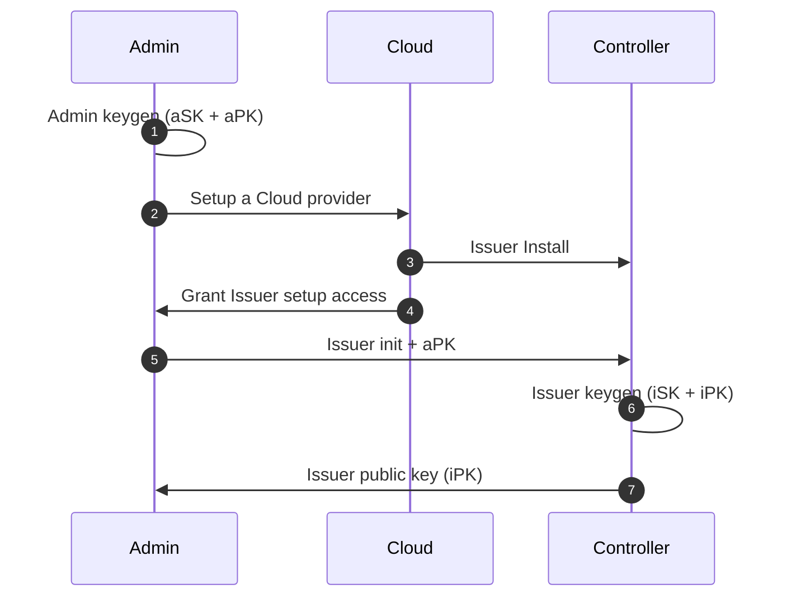
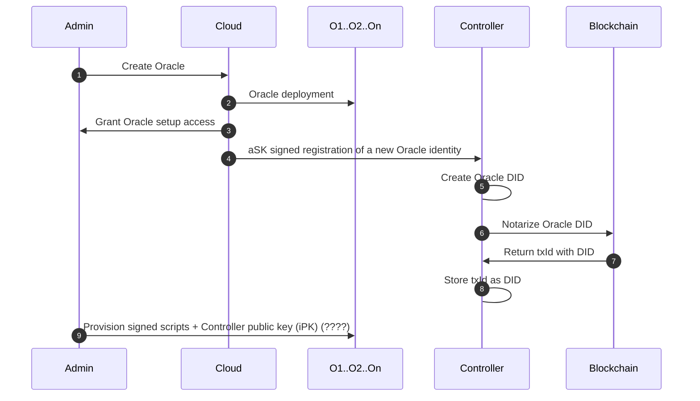
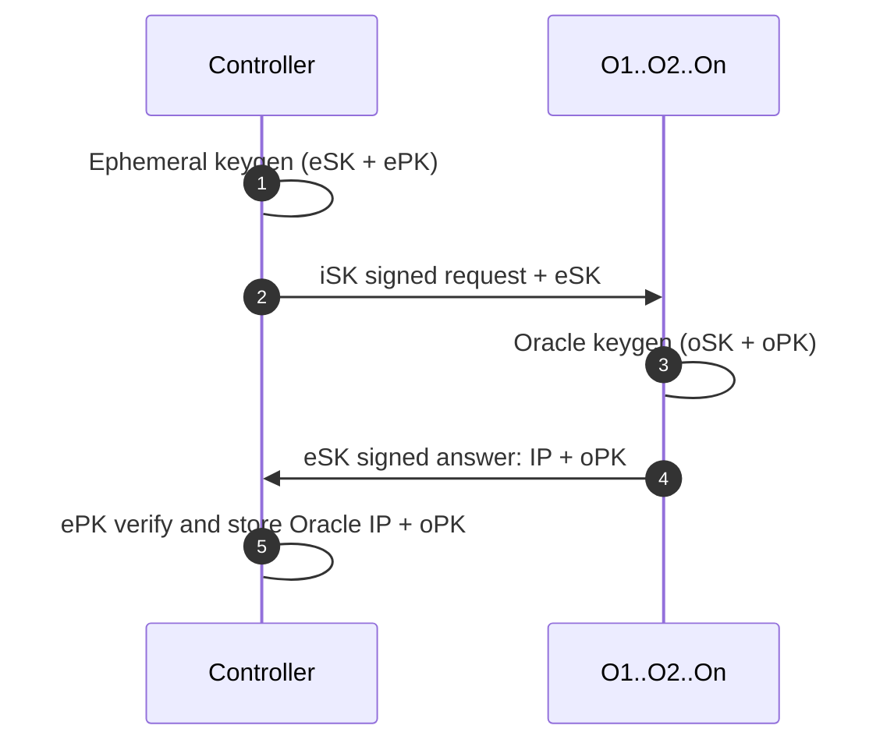
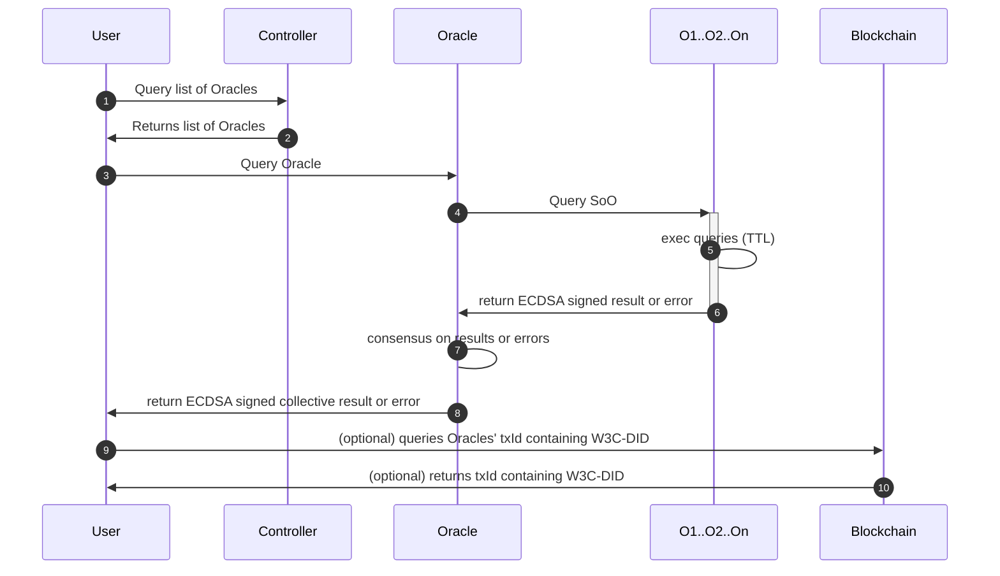
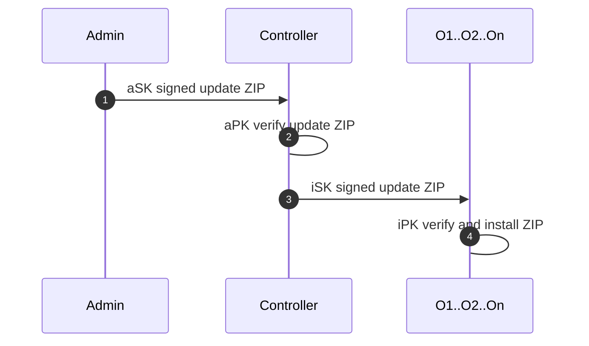

# Zenswarm
Zenroom based Swarm of Oracles 

# Deployment

## Requirements
*  Linux based machine 
* the hostname on the host machine, must be reachable from the internet (can be an IP), the oracle use the hostname to announce their identities to the Controller
* Ports between the 20000 and 30000 must be open on the host machine
* On the host machine, add to /root/.ssh/authorized_keys the pubkey you will use to deploy from your workstation: ansible will use this pubkey to obtain root privileges on the host (not required if using the Linode scripts)
* Open an ssh port for ansible, can be configured in hosts.toml (default: *ansible_port=22254*) (not required if using the Linode scripts)
* The Oracles' ansible installs an SSL certificate using Letsencrypt and the oracle currently comunicates via https. This can generate issues on machines behind a proxy (e.g. a virtual machine).  
* (DID-Controller only) redis running on port 6379

## How to install

* *git clone https://github.com/dyne/zenswarm/*
* edit hosts.toml to set: 
  * address of target machine for deployment (default: zenswarm.zenroom.org ) 
  * port that ansible will use to connect to the host (default: *ansible_port=22254*)
  * amount of oracles to be deployed on that machine (default: *nodes=3*)
* edit *./ansible/init-instances.yml* in case you want to use a different DID Controller to perform the announce and deannounce (defaults: **announce_url: "https://did.dyne.org/api/W3C-DID-controller-create-oracle-DID.chain"** and **deannounce_url: "https://did.dyne.org/api/W3C-DID-controller-remove-oracle"**)  
* edit *./ansible/subscription.csv* to define which Oracle will notarize from which L1 to which L0
* **make setup-tls** to install the SSL certificate using Letsecncrypt
* (If deploying on Linode): execute **make one-up IMAGE=(name of the linode image)** 
* (If NOT deploying on Linode): execute **make install**

# How to run
After installation, run:
 * **make init** to generate the secret keys of the Oracle(s)
 * **make start** to generate the identity and trigger the announce of the Oracle(s)
 * **make kill** performs a graceful shutdown that deannounces the Oracle(s), unregistering the Oracle(s) from the DID Controller


# Monitoring

* On the machines where the oracles are deployed, use **pm2 list** to see how many instances of restroom_mw are running.
* A GUI-based monitoring service for the Oracle is the [Zenswarm-Dashboard](https://github.com/dyne/Zenswarm-Dashboard). The GUI retrieves a list of the active Oracles from the W3C-DID controller

# Provisioning

Once an Oracle is deployed, each Oracles tries to *announce* to the W3C-DID controller. In this stage, the Oracle will communicate its pubkeys, its version and some metadata. The W3C-DID Controller will register a DID per each Oracle, and store the DID-document on a database and blockchain. 

Upon graceful shutdown, done via *pm2 delete [instansce-name]*, the Oracle will *deannounce* itself, which will prompt the W3C-DID Controller to remove the Oracle from the database.

Specs about the DID implementation is in [Dyne.org's W3C-DID](https://github.com/dyne/W3C-DID).


# Oracles diagrams

Below a list of the main Oracle flows involving:
 * Controller provisioning: provisioning of the DID Controller producing signed DID Document for the Oracles
 * Oracle Provisioning: key issuance, DID document creation
 * Oracle consensus based query
 * Oracle update

## Controller creation



1. Admin is the control terminal and generates a new keypair (aSK + aPK)
1. Admin sets up a Cloud provider (one or more) can be remote or on-premises
1. Issuer is created by the Cloud provider and installed with a signed OS
1. Cloud grants to Admin setup access to the Issuer
1. Admin initialized the Issuer machine with signed scripts and the Admin public key
1. Issuer generates an issuer keypair (iSK + iPK)
1. Issuer shares its public key (iPK) with the Admin


## Oracle creation



1. Admin orders the creation of Oracle to the Cloud provider
1. Cloud provider creates the Oracle on a new allocated IP and installs a signed OS
1. Cloud provider grants the Admin setup access to the Oracle (IP + SSH)
1. Cloud announces Oracle identity to the Controller
1. Controller creates DID document for Oracle (containins DID of future txId)
1. Controller notarizes DID document of Oracle on Blockchain
1. Blockchain returns txId storing DID document Oracle 
1. Controller stores txId as DID document (txId DID is contained in Oracle's DID Document)
1. Admin provisions the Oracle with a signed OS setup and the Issuer public key

## Oracle key issuance 



1. Issuer generates an ephemeral keypair used only to verify the Oracle registration
1. Issuer signs the ephemeral secret key with iSK and sends a request to the Oracle IP
1. VM verifies the registration request with iPK and generates a VM keypair (vSK + vPK)
1. VM signs an answer with eSK and sends back its public key
1. Issuer verifies the answer signed with ePK and saves the VM public key and its IP

At the end of the process the ephemeral keys are discarded and the Issue has added to its database a new IP and its associated public key.

## Oracle multiple query operation 


1. A query is made to the Swarm of Oracles Issuer by a User (or an event or a time trigger)
1. Issuer parses and validates the query syntax, then propagates to all oracle VMs
1. VMs execute the Zencode associated to the query: may access other online services, query databases and external APIs
1. VMs return results of the Zencode execution or an error
1. Issuer verifies that all results are equal (full consensus) or raises an error
1. Issuer returns the verified result of the query or a list of specific errors occurred

## Oracle update


1. Admin signs and uploads a ZIP with updated scripts
1. Issuer verifies the ZIP is signed by the Admin
1. Issuer signs and uploads the update ZIP to all VM
1. VM verifies the ZIP is signed by the Issuer and installs the scripts


## APIs 

Below a list of the APIs available on an Oracle

**Get Identity**
----
  Returns json data containing the Oracle's identity: 
 * Identity
  * uid: contains URL and HTTPS port 
  * baseUrl: the URL 
  * HTTPS port
  * ECDSA, EDDSA, Schnorr, Dilithium, public keys
  * Ethereum and Bitcoin address
  * List of available APIs
  * Country
  * State (region)
  * subscriptions: list of blockchain(s) the Oracles has a websocket subscription to
  * L0: blockchain the Oracle is notarizing onto
  

* **URL**

  /api/zenswarm-oracle-get-identity

* **Method:**

  `GET` or `POST` 
  
* **Data Params**

  None

* **Success Response:**

  * **Code:** 200 <br />
    **Content:** 

```json
{
  "identity": {
    "API": [
      "/api/zenswarm-oracle-announce",
      "/api/ethereum-to-ethereum-notarization.chain",
      "/api/zenswarm-oracle-get-identity",
      "/api/zenswarm-oracle-http-post",
      "/api/zenswarm-oracle-key-issuance.chain",
      "/api/zenswarm-oracle-ping",
      "/api/sawroom-to-ethereum-notarization.chain",
      "/api/zenswarm-oracle-get-timestamp",
      "/api/zenswarm-oracle-update",
      "/api/zenswarm-oracle-get-signed-timestamp",
      "/api/zenswarm-oracle-sign-dilithium",
      "/api/zenswarm-oracle-sign-ecdsa",
      "/api/zenswarm-oracle-sign-eddsa"
    ],
    "Country": "FR",
    "L0": "ethereum",
    "State": "NONE",
    "baseUrl": "https://swarm1.dyne.org",
    "bitcoin_address": "bc1q2eje20v242z9walf35vv78e9t364qat7gptl33",
    "description": "restroom-mw",
    "dilithium_public_key": "WR6I8Y2/D7pN9wUypkNqoG1ivSozcezyLTovGDBpJYxn3PIO7m2sDJYHx8cr9tJVpCcpdSdregQEWG7iHdgyMwXic60JajTQfifyZCHOStJRYwEXKBA36fMnu/0rK6kjGjImXCGIfGO8gDdvVtWe1x2HmN4XBoLsE+J7Qbwqir+qub3AssQKg+xyq/4DYRGyrqG0kiablY5RaUR66eaVVORgTR2eHza58nf/iCDUkol3Y//yM8CS7BS4bPh+ARd+3Dk2P++XLXzi8kV4Vrj5S4nIVv7D5AbPBUYQc6uTKyw7ybhON2x21MHGWfF0s83J4P1h/yMtObnYg9DxJQAHGZrpc6RvH2fND2hUB0PobdrzRQLz79jm+Pn1oFbhq7LsQep6CFsO2iqQquab3Qes41W16V3gVd2aNtzhbTqaTRr+hU7/T8bYf0dv1r0jZuZvaMnfpbiPpesQ0izSh7lO1l7TrMHNZbVPU/vB9P53stGuqcEXrsmz6W/ExoVCusj2L6DCMo3q2y42XRT2tA3JXsjMrFJKzc2DI1UdOkOuP7jzuc9WxlwFSTHvIdZDrG8SuWiRZYGda6ZzQBvCPgkqpaDRmsZvrC4IGNFeuAcedNZWMI6W+fvw+csOToLOwRUqUmJqhrjjc8dZ0EfyKM34PMp1z8TKcPh/wUWeXOZ6HJCfbEcyNZHNpBXtabhA/bMS3dhVnUR2hDgF5/Ch3wgevXB22VlpQECkRIFkZ6C3q8MD5mVIVQ9hSsHp9hy/mqzCkuRiIrVNfDEglgpMJCtimX5l0prnQPyB5I1B2zWNNJDxuzFGhRn7Nuj5l7Xq0rJN+wa5JlPQmOrTR55YKWi5HrP/r3Z6VAanf23fsWuaNayIDhsDv21Jgg3x+vo2aCx5kuYPnx67ci/3CDOK8YRfAHKuZm2LojEs0GB+FW4H71wQW/46p7LKlvHbU4/XjZFaW3gbrErKIlSVj4eL3kxi9/eCXEoRSueLBips/RWnS+Nrttf6jFLogOyJERFmLYMq+RpC2oViPgRDc3AGfsMlkJUrDY71LkrxbfMCAJXC94OE6A4egUzZTOkch/6dVWSLvOEX4z8ojSEyS5EwlOuVLoa9p+k+VqNRniqGXgto7083RKFu+6HGfQ5HG4CBurpzm7FJ3POM5h246urjyXB6CYVb7qgIa0MhjdNqAZSX+Uhwl0z/Q329vqbM4OZfO3tPO2M6TCPKDb/fcao22bYoNx4P0WfGGtHlzw8TpSQLPnsLpGX7da7LLKsBty2EDCElSlyGDWpoALNui02SGsAiSSF7MDg/ili/GJrYUPlV336X/hg/qqmd+gTVWK88qSyF6NEf7+jMxyHw4a7O7wrRi+PuzH1OJYSTINYGFIwc22MwDZ01gN38s/9i72FQQnI+7Jybt06JZtu/l9cnJp+17qmnZYGskswF1FM6YFGiIxS2++NmW9Vj1iIb1atpcfc9nU7P3RzgOy39Pcc3LH/32eN38Gc4oGB6t2uGqK0UeYAm+hj17+rGrOQGAd4FnJTWmk2euRuGtzU3Xps4YNIxU5kVEe1zMGyb+ueZGLRfu8CsLXqKv8jDWd19Ek1cSceUgUUhdJFXdu4gpiSw4w+QkSrok3A/4dYa30/W/SSyBbDRZ1U2p2ANYhz04oTJe1fEvasf9P9EQsArxQQMPMSdozhHiR3DJ8eks927/eT6YHUzUyL3PgvnOBlmsNxjJQEWARG9eC2NdD+Nvw/L/xZBdg==",
    "ecdh_public_key": "BKQKsKZsau62MJAk3nsEK/NoKdS80+a0j7TezfbwrWdAEPJzWk5/yAPldkVL3eiQkz3x2z6FDcIex7cu9W5aYf8=",
    "eddsa_public_key": "FFB2sQifRQNRLmetRroJ8PvcudBxBuRoYQpMSYdQhg6L",
    "ethereum_address": "e785f9e188f8137ec13ecea52ed753d4c7c7c064",
    "ip": "swarm1.dyne.org",
    "port_https": "20003",
    "reflow_public_key": "E+QVn6d+mrTDPl8g/a98CL9K+CVG1LRG1mdFvYb1nhAFHtMOVw+t3Y6gc+zzTKO7AFRwHyaYI9moXCKanHdcLS37+ebRuxoxB9qOwZhPM6IWJj9opQPdql8xdMz7T1yKBHnq7uy4rkywwUkSgG32nQXA7zPJKwHq+ieLaD65ePzi1n21L1vjIlNBVVDTjGmHD3/xTmgxSVcM8eYswOBSxv+EsU6YhAj9EAgp+OoTW2h7bSIPTXgI8i1COtcw2emA",
    "schnorr_public_key": "D54MEEyah5gC76dQscft9ggFt29tENpcp4Ms+6z5ZBaChQeu3iZee5/81Mq9MJEg",
    "tracker": "https://apiroom.net/",
    "uid": "swarm1.dyne.org:20003",
    "version": "2"
  },
  "subscriptions": {
    "iota_devnet": {
      "api": "https://api.lb-0.h.chrysalis-devnet.iota.cafe/",
      "name": "iota_devnet",
      "sub": "mqtt://mqtt.lb-0.h.chrysalis-devnet.iota.cafe:1883",
      "type": "iota"
    }
  }
}
```

 
* **Error Response:**

	None

* **Sample Call:**

```shell
 curl -X 'POST' \
  'https://swarm1.dyne.org:20003/api/zenswarm-oracle-get-identity' \
  -H 'accept: application/json' \
  -H 'Content-Type: application/json' \
  -d '{
  "data": {},
  "keys": {}
}'
```


**Ping**
----
  Returns json data with a string.

* **URL**

  /api/zenswarm-oracle-ping

* **Method:**

  `GET` or `POST` 
  
* **Data Params**

  None

* **Success Response:**

  * **Code:** 200 <br />
    **Content:** 

```json
{
  "output": [
    "I_am_alive!"
  ]
}
```

 
* **Error Response:**

	None

* **Sample Call:**

```shell
 curl -X 'POST' \
  'https://swarm1.dyne.org:20003/api/zenswarm-oracle-ping' \
  -H 'accept: application/json' \
  -H 'Content-Type: application/json' \
  -d '{
  "data": {},
  "keys": {}
}'
```

**Get timestamp**
----
Returns json data with a string, containing the timestamp fetched using the JavaScript method **getTime()** from the host machine

* **URL**

  /api/zenswarm-oracle-get-timestamp

* **Method:**

  `GET` or `POST` 
  
* **Data Params**

  None

* **Success Response:**

  * **Code:** 200 <br />
    **Content:** 

```json
{
  "myTimestamp": "1656931966016"
}
```

 
* **Error Response:**

	None

* **Sample Call:**

```shell
curl -X 'POST' \
  'https://swarm1.dyne.org:20003/api/zenswarm-oracle-get-timestamp' \
  -H 'accept: application/json' \
  -H 'Content-Type: application/json' \
  -d '{
  "data": {},
  "keys": {}
}'
```


**Get signed timestamp**
----
Returns json data with a string, containing the timestamp fetched using the JavaScript method **getTime()** from the host machine, along with its ECDSA signature, produced by the Oracle its ECDSA sk

* **URL**

  /api/zenswarm-oracle-get-signed-timestamp

* **Method:**

  `GET` or `POST` 
  
* **Data Params**

  None

* **Success Response:**

  * **Code:** 200 <br />
    **Content:** 

```json
{
  "ecdsa_signature": {
    "r": "ivjynFRQXm4EYKGwYpXSejoZvLNmEYHb3O5pFh2I+F8=",
    "s": "DWLIWDtSTxfyuKRuj2d0uIkRjKRaaJwvoBbU+qmFZJQ="
  },
  "myTimestamp": "1656932308339"
}
```

 
* **Error Response:**

	None

* **Sample Call:**

```shell
curl -X 'POST' \
  'https://swarm1.dyne.org:20003/api/zenswarm-oracle-get-signed-timestamp' \
  -H 'accept: application/json' \
  -H 'Content-Type: application/json' \
  -d '{
  "data": {
    "keyring": {
      "ecdh": "mukeqwntoJPtAN94jgahUA/ID7NptMLNL84sMPJ++eY="
    }
  },
  "keys": {}
}'
```


**Dilithium signature**
----
  Returns json data contained in **asset** along with the [Dilithium QP signature](https://pq-crystals.org/dilithium/), produced by the Oracle its Dilithium sk. 

* **URL**

  /api/zenswarm-oracle-sign-dilithium

* **Method:**

  `POST` 
  
* **Data Params required:**
   
  `asset={data}`


* **Success Response:**

  * **Code:** 200 <br />
    **Content:** 

```json
{
  "asset": {
    "array": [
      1,
      2,
      3
    ],
    "dictionary": {
      "number": 1969,
      "string": "hello world again!"
    },
    "number": 42,
    "string": "hello world!"
  },
  "dilithium_signature": "Mih4ovrG/Zm2H4yj1tqGBjzpMt3bihqbaDdMK5Tc6Ba6I9R6QFv82pxLTZMhzpcglt3j9kRRX2yCmHVzPSz3uwPB4Luzdn9dFiHh7mU3XcupJaTbDpeaMRljmioacWp21w7szJ2KK6Ob8/qRUCt5JEOkpZB4FTWoItrz6KqWNtDGMsWSJalfiNoPuklcpes9lxXMQVRDtGg/Hii3rEHf7mg3IlAYZVJ2vGLQBh7OjQiUCmK29RFa49eMWhx1aImiuduEY+0gRc1yhM6jMtrgKIqt2+W2uMvF6qccoGOLgnSGtNapljesIx0W74x/3detwyuVFDeikh6Nh1SdQHbHHtCXez89anWELYLY4XwrwC86KAa609FwdPAIjlsp9OnQ4XDS5k7Okhll9kA+G8EFm8OeorzmJkTOCjsgd37KcJ10LvOHpS6Ux/PIdG8pGt816MvaYmSGG8yQWzHu3DNK2aa4hcLDDxvRCEUHW0LiXA30+/p+jmthvI9pvDq/EK1bDKltxjeWrMP/wzyYD/88b3pZ7KTbCNPx/BGg36TBChc/0xt17NeZZASiMsJLGYzJMRkiNJhRs8qowYIDXGsWJtcd3XWFOZMkSHIKRcLUn3WEFLSl/XwfqtH7mx2R/apm4/t+NO0qTg+c4511oCKUdvfV5guCPRCevjCI5EhjViAd1j8hajGWPpz5boqyvzNcPTuNNXORORm+n2pmC8ht6I2zPtXHBWvuF6QMwnxLGi7Hbx3TevGPC/Xk0C5rbVeD8vKps3gquvJ6OlizATI8UElPP4pnjzCf0hw5n3hCFw9F+aBxWAGQfEqmzfZNyLz+uH39d9j9RUPCuvOv2LBmp7GHcZfw0/7tyvlaW+n2rEXDVUNaUY/LxiVcWr/FPO7sN1pkIQkr8KK/k0ggAOlPNIPBi/bsnwwzfmbY/s/1eruZHXRzhxY31bx0ievHQmCJfDAWYyW4v3wwZ2lJVwaBRTbkViYr5qFi6aCnY2MC0rpd59dHNvFU1cf0rGS1sIdU6Q3jbDDjwRDhLsjOv4TPlQhVyGDxcPurFfHiV9zHGYI9ACf96klweCH5NNgh7kqrjTN/MN3/dDPSPimpLW50aeolKdOAZTqrZzd2yDdbm7nxmnuA9LzqOHXMRKSEi5LmeOt0l36qIG4zEteYse0ANEhyEU5w0S4BoNbQ9BWpN4u2l3P+5yOtp6clNF/Wm5mB+L1d5xTsm8293iVSwOMQAoEltd4K2dvKJFo7LcryE+zZTyVZetKHYW22RRLTmqdoOjvYXlY99CE/aj9EPANdIaTkIbcGJTuvg3ZK7Xh2GRt1on9jQWjbNA3fjrbx4y9BaNQoJAdJCfojjO8ppGU/jYT3iPtX+kWHOJuElqCwvteeLtJA6i9nLrqIgcAlkboJ2YvxgxUcCZBu44HNsN1xxudONyN8rsIy1CLLYQ+W8Rh78tY342Rsb4r9ZuBGBrqtNnG4UQu8MQ7LdXcKBWAdx3jK5L6EoxT3Go1CRb5s/i6I6tQz5aNUA6dqnKc3SjYg1cqqDg+jJaAeW1aoclWTGYILWMC9f932EGtmiveEeBNgvJUwCREMysFXM65ePDs10CeBByKytt2m+InnTqKXw0XyuCaEqISNc8oRDkxlen1/833a/2y5GszfNaA4POCwUCxHeL+a+09piOeEI0XbwoxtAAqqG9xUeWO+SS5r7O3qYeMNqdvXThCzor9ECtUomO0rc2AfiUpxpq4BO9hxmlzpfDRU347rr81/tnwfG3QF9Bz6f7ICREBq/r1rqNH1LC8v4kZuZYYdfoSfMYjckMt4nLjhc5456FxKdJgeQ/XUl2L1Nsj8IVta52mogFYZ0ZJXQFrw3j5l4JV2mnvoP8apGliGosPX3gkIV4bQNTpN2mE+oVTG+DPKf5ePai0cXaMWGJexjTRseGtg9gfUzN5yXXmEzHGOh9e/PYu7ro4GpmTVTNpmwfAGeLJieO0eGIK/UJUiWM+sGM7q1l2Lhdym0YthrgiPc4sLZfUE9thEaBUTmNm9ZtrrMcCpoDUqPpLGxhbxJx2LSiIMvHHsqFXBZ2fbPJRYHxFyTTSjnLkbC6+ds9GKIy4XkCG1tTgScF5upIpaaJ2cvMKoLvPv8uLPmrRnHb0BYvih6WDTXV6QdMX7Nw+y33CYxmmpemstodVhfKk6lKaJCqn3XjKrT0IdohdLMK9/8lWRzfoffdiRV5yAKPTMNaaoRXW86y3BEgYTIibYeePDOL1e4kFHwh6AP2ZhQKT/FvDl9+DqSYPj7wQLqzpkqjMxOdAoNC3xOS517V8sTTe0/tlG1CZnmvmcyWXYAj7UPRomRzkUrM7klQC+ctIcutofBvr5dooYx3+R5g0FTNsR0y5VYoIKp5pesGnuRtmbm9c6BB4AQAPHHwCUDfKMC+zUH5CTmyUFfH9/ercwVreMNOOpUWtAqvdtxpuy8+E3CyKgcpWCrSnFeNmeo2XZXsv4XdNu3ZUWHNjP9tw7PlT7ROx6RAjOIrqOXUyw5onzaROx3ScwY6EHwBDnjQJQ7dBeK89CdaDWrqFhkRKsKjVWhJ49aObCLnNNlHg4eLWRlL88Yu/xDha84a5KgD3ZiNAjQGlWNKhW8XrgGS8hLHiSQJeKU1QOP+B2L7b4ilLSLwOwp6ZikzkEhxi/96PYDmAqYIJMjbVQ3u0Yja39xgy5H6HKv5fAClFpptLa0nLTR1+cjHSVGP/mdAre+SiXCUnbB8tZbGGRr8zmnGgVUG2kE+9PPf5VZc/bEbxldHD2FRWJNfTq9FHekSKRnE8PORKaXJmTOTmJ8oCzdYzROv5qeSOhKzBGCnoqWhNi9Gb9DMcfr50xtwy5Ak6FZdewPAPCqSKjvWBrg1rxjMWNdoGHwPHnN8XRCpFCxf36Pr9P1dlSf/9PALbRRYCpLroxlZQR+XpZT/vulf1mULFtW5VLZ6Ma38h27mxW5V9lFXAoGfb+s394fwix0Y7sNJhlLY6ycm6HgODuSsfpSwGNhEq4+r82OUFIWa9k+Wgn4+Us4hqfN6uYqWZcerleeeheRT7qq7SP+Ywv/ZvyOO4Tw0YvIdqNguL/ZFKwqj47f0nthidP0fFehecVFy0zNUhZXoqgpqew2fAFCBEYHCsuP0BLUmt0iq+4vfELECM4OWh9vcTZ6OwCR3ydoKrDxAAAAAAAAAAAAAAAAAAAAAAAAAAAAAAAAAAAAA8hLTU="
}
```

 
* **Error Response:**

	* **Code: 500 Error: Internal Server Error** 
    **Content:*
    
```json
{
  "zenroom_errors": {
    "result": "",
    "logs": " ***Zenroom ERROR logs*** " 
  },
  "result": "",
  "exception": "[ZENROOM EXECUTION ERROR FOR CONTRACT zenswarm-oracle-sign-dilithium]\n\n\n Please check zenroom_errors logs"
}
```

* **Sample Call:**

```shell
curl -X 'POST' \
  'https://swarm1.dyne.org:20003/api/zenswarm-oracle-sign-dilithium' \
  -H 'accept: application/json' \
  -H 'Content-Type: application/json' \
  -d '{
  "data": {
    "asset": {
     "string": "hello world!",
	 "number": 42,
	 "array": [1,2,3],
	 "dictionary": {"string": "hello world again!","number":1969}
    }
  },
  "keys": {}
}'
```


**ECDSA signature**
----
   Returns json data contained in the **asset** along with the **ECDSA signature**, produced by the Oracle its ECDSA sk 


* **URL**

  /api/zenswarm-oracle-sign-ecdsa

* **Method:**

  `POST` 
  

* **Data Params required:**
   
  `asset={data}`

* **Success Response:**

  * **Code:** 200 <br />
    **Content:** 

```json
  "asset": {
    "array": [
      1,
      2,
      3
    ],
    "dictionary": {
      "number": 1969,
      "string": "hello world again!"
    },
    "number": 42,
    "string": "hello world!"
  },
  "ecdsa_signature": {
    "r": "VSWtbgWid2bMvXDVd2pemTlYb204E3+TgjhQh1nu38M=",
    "s": "EH16QToBcWVqasQ8+3uTSgklvvk6odXw/ut1KuDDHkk="
  }
}
```

 
* **Error Response:**

	* **Code: 500 Error: Internal Server Error** 
    **Content:*
    
```json
{
  "zenroom_errors": {
    "result": "",
    "logs": " ***Zenroom ERROR logs*** " 
  },
  "result": "",
  "exception": "[ZENROOM EXECUTION ERROR FOR CONTRACT zenswarm-oracle-sign-ecdsa]\n\n\n Please check zenroom_errors logs"
}
```

* **Sample Call:**

```shell
curl -X 'POST' \
  'https://swarm1.dyne.org:20003/api/zenswarm-oracle-sign-ecdsa' \
  -H 'accept: application/json' \
  -H 'Content-Type: application/json' \
  -d '{
  "data": {
    "asset": {
     "string": "hello world!",
	 "number": 42,
	 "array": [1,2,3],
	 "dictionary": {"string": "hello world again!","number":1969}
    }
  },
  "keys": {}
}'
```


**EDDSA signature**
----
   Returns json data contained in the **asset** along with the **EDDSA signature**, produced by the Oracle its EDDSA sk 


* **URL**

  /api/zenswarm-oracle-sign-eddsa

* **Method:**

  `POST` 
  
* **Data Params required:**

  `asset={data}`

* **Success Response:**

  * **Code:** 200 <br />
    **Content:** 

```json
{
  "asset": {
    "array": [
      1,
      2,
      3
    ],
    "dictionary": {
      "number": 1969,
      "string": "hello world again!"
    },
    "number": 42,
    "string": "hello world!"
  },
  "eddsa_signature": "3E7obC3UDtVsf5v8c52pYbqv39pJeFHGyFbqnK2shZdmtPB3EjfpwAKwYdZ8jrDGe6buHXUDvD9ZVeADLErLdMv6"
}

```

 
* **Error Response:**

	* **Code: 500 Error: Internal Server Error** 
    **Content:*
    
```json
{
  "zenroom_errors": {
    "result": "",
    "logs": " ***Zenroom ERROR logs*** " 
  },
  "result": "",
  "exception": "[ZENROOM EXECUTION ERROR FOR CONTRACT zenswarm-oracle-sign-eddsa]\n\n\n Please check zenroom_errors logs"
}
```

* **Sample Call:**

```shell
curl -X 'POST' \
  'https://swarm1.dyne.org:20003/api/zenswarm-oracle-sign-eddsa' \
  -H 'accept: application/json' \
  -H 'Content-Type: application/json' \
  -d '{
  "data": {
    "asset": {
     "string": "hello world!",
	 "number": 42,
	 "array": [1,2,3],
	 "dictionary": {"string": "hello world again!","number":1969}
    }
  },
  "keys": {}
}'
```


**Schnor signature**
----
Returns json data contained in the **asset** along with the **Schnorr signature**, produced by the Oracle its Schnorr sk 


* **URL**

  /api/zenswarm-oracle-sign-schnorr

* **Method:**

  `POST` 
  
* **Data Params required**

  `asset={data}`

* **Success Response:**

  * **Code:** 200 <br />
    **Content:** 

```json
{
   "asset": {
      "array": [
         1,
         2,
         3
      ],
      "dictionary": {
         "number": 1969,
         "string": "hello world again!"
      },
      "number": 42,
      "string": "hello world!"
   },
   "schnorr_signature": "GO2MvxSUezuUGnNXJ8715MisUCn+bXzjISI311MhdWiXTfilahlFwUkwqFQ1MvBMBD/sA52Jq3h4T5zFMzSaZJfsMQZeTrJ64fG38oBw4Qw="
}

```

 
* **Error Response:**

	* **Code: 500 Error: Internal Server Error** 
    **Content:*
    
```json
{
  "zenroom_errors": {
    "result": "",
    "logs": " ***Zenroom ERROR logs*** " 
  },
  "result": "",
  "exception": "[ZENROOM EXECUTION ERROR FOR CONTRACT zenswarm-oracle-sign-schnorr]\n\n\n Please check zenroom_errors logs"
}
```

* **Sample Call:**

```shell
curl -X 'POST' \
  'https://swarm1.dyne.org:20003/api/zenswarm-oracle-sign-schnorr' \
  -H 'accept: application/json' \
  -H 'Content-Type: application/json' \
  -d '{
  "data": {
    "asset": {
     "string": "hello world!",
	 "number": 42,
	 "array": [1,2,3],
	 "dictionary": {"string": "hello world again!","number":1969}
    }
  },
  "keys": {}
}'
```

**HTTP Post**
----
Returns json data containing the result of the POST performed by the Oracle 


* **URL**

  /api/zenswarm-oracle-http-post

* **Method:**

  `POST` 
  

* **Data Params**

  `post{data={data to post}}` 
  
  `endpoint={URL}`
  
* **Success Response:**

  * **Code:** 200 <br />
    **Content:** 

```json
{
  "output": {
    "result": {
      "User123456": {
        "keyring": {
          "ecdh": "a5b0Zw3RNUlUcKk9ZSmt53uesVJW5PHQ8gcKISbQjvo="
        }
      }
    },
    "status": 200
  }
}
```

 
* **Error Response:**

	* **Code: 500 Error: Internal Server Error** 
    **Content:*
    
```json
{
  "zenroom_errors": {
    "result": "",
    "logs": " ***Zenroom ERROR logs*** " 
  },
  "result": "",
  "exception": "[ZENROOM EXECUTION ERROR FOR CONTRACT zenswarm-oracle-http-post]\n\n\n Please check zenroom_errors logs"
}
```

* **Sample Call:**

```shell
curl -X 'POST' \
  'https://swarm1.dyne.org:20003/api/zenswarm-oracle-http-post' \
  -H 'accept: application/json' \
  -H 'Content-Type: application/json' \
  -d '{
  "data": {	
      "post": {
		    "data": {
			    "myName": "User123456"
		}
	},
	"endpoint": "https://apiroom.net/api/dyneorg/API-generate-keyring-passing-user-name"
},
  "keys": {}
}'
```


### Reserved APIs

The following APIs contain the *business logic* of the Oracles and are used only internally, therefore not documented:

/api/ethNotarization-0-newhead

/api/ethNotarization-1-newhead

/api/ethNotarization-2-filter-newhead

/api/ethNotarization-4-ethereum-store

/api/ethereum-to-planetmint-3

/api/ethereum-to-planetmint-4

/api/iota-notarization-to-eth-0

/api/iota-notarization-to-eth-2

/api/iota-to-planetmint-1

/api/sawroom-notarization-0

/api/sawroom-notarization-1

/api/sawroom-notarization-2

/api/sawroom-notarization-4

/api/sawroom-to-planetmint-3

/api/zenswarm-oracle-announce

/api/ethNotarization-3-ethereum-store

/api/iota-notarization-to-eth-1

/api/sawroom-notarization-3

/api/ethereum-to-ethereum-notarization.chain

/api/ethereum-to-planetmint-notarization.chain

/api/iota-to-ethereum-notarization.chain

/api/iota-to-planetmint-notarization.chain

/api/sawroom-to-ethereum-notarization.chain

/api/sawroom-to-planetmint-notarization.chain

/api/zenswarm-oracle-key-issuance.chain

/api/zenswarm-oracle-generate-all-public-keys

/api/zenswarm-oracle-key-issuance-1

/api/zenswarm-oracle-key-issuance-3

/api/zenswarm-oracle-update

/api/zenswarm-oracle-key-issuance-2


### Update instances 

The instances now have update mechanism, triggered via an API (currently working only with 6 instances). The update flow to the instances is triggered by the API:

https://apiroom.net/api/dyneorg/consensusroom-update-all-instances

The API needs no parameter.


